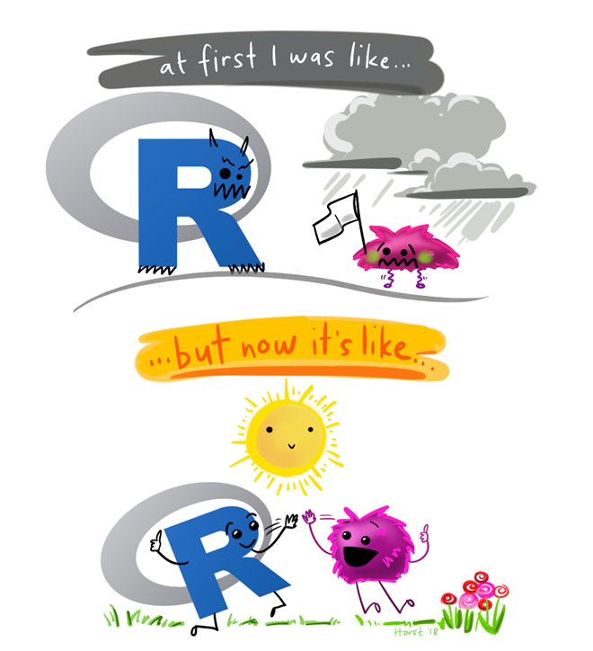

:::::: columns
::: {.column width="50%"}
Dieser Kurs vermittelt das Handwerkszeug für quantitative Datenanalyse mit R — von der Installation über Datenvisualisierung bis hin zu statistischen Analysen. Keine Programmierkenntnisse erforderlich.

Den vollständigen Seminarplan, die Anforderungen und die Pflichtlektüre findest du im [Syllabus](syllabus.qmd). Folien und R-Skripte werden wöchentlich unter [Sitzungen](sitzungen.qmd) bereitgestellt, Übungsaufgaben unter [Übungen](uebungen.qmd).

::: callout-note
#### Auf einen Blick
**Kurszeit:** Dienstag, 10:00–12:00 Uhr c.t.\
**Kursort:** Ihnestr. 22, UG 1\
**Kontakt:** [maura.kratz\@fu-berlin.de](mailto:maura.kratz@fu-berlin.de)
:::

:::

::: {.column width="5%"}
:::

::: {.column width="45%"}

:::
::::::
