# Was heute ansteht:

-   Vorstellungsrunde
-   Warum computergestützte Datenanalyse lernen?
-   Warum R?
-   Was ist R? Was ist R-Studio?
-   Was erwartet uns in diesem Kurs?
-   Was ist bis kommenden Dienstag zu tun?

# Vorstellungsrunde

## Wer bin ich?

::::: columns
::: {.column width="70%"}
-   Maura Kratz

-   AB Vergleich politischer Systeme mit Schwerpunkt DE und FR

-   Dissertation zu Themen der politischen Ungleichheit und Repräsentation

-   2020 BA in Sciences Politiques an SciencesPo Paris

-   2023 MA in Affaires Internationales & Politiwissenschaft an der SciencesPo und der FU

-   Seit 2023 WiMi und Promovendin

-   **Wie wollen wir uns ansprechen?**
:::

::: {.column width="30%"}

:::
:::::

## Wer seid ihr?

**Sitznachbar\*in kennenlernen**

::::: columns
::: {.column width="60%"}
1.  Worauf freust Du dich in diesem Semester am meisten (außerhalb der Uni)?
2.  Welches Thema (egal welches!) hat dich zuletzt begeistert?
3.  Was ist die letzte richtig gute Serie, die Du geschaut hast?
4.  Wie lange hast du heute zur Uni gebraucht und mit welchem Verkehrsmittel warst du unterwegs?
:::

::: {.column width="40%"}

:::
:::::

## Wer seid ihr?

**Zwei Wahrheiten, eine Lüge**

::::: columns
::: {.column width="60%"}
1.  Jede\*r notiert drei Aussagen über sich selbst: Zwei wahre und eine erfundene.
2.  Wer den Ball zugeworfen bekommt stellt die drei Aussagen vor.
3.  Wir stimmen gemeinsam ab, welche der drei Aussagen wir für die erfundene halten.
4.  Auflösung.
:::

::: {.column width="40%"}
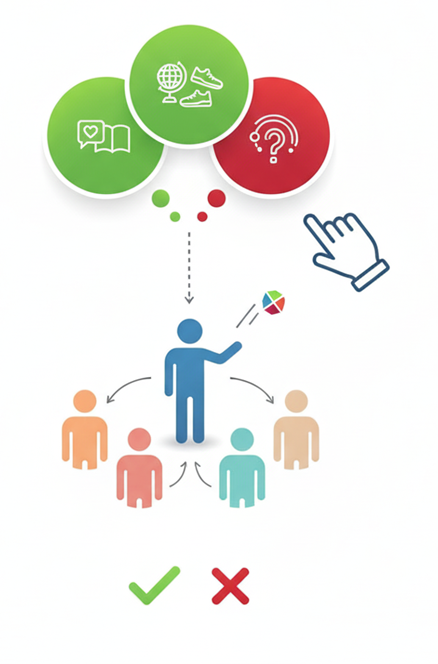
:::
:::::

## Wer seid ihr?

**Es steht auf wer…**

::::: columns
::: {.column width="60%"}
1.  … eine Sprache spricht, die nicht Deutsch, Englisch oder Französisch ist.
2.  … aktuell mehr als 20 Tabs im Browser geöffnet hat.
3.  … Pflanzen zu Hause erfolgreich am Leben erhält.
4.  … dieselbe Serie schon mehr als dreimal komplett durchgeschaut hat.
:::

::: {.column width="40%"}
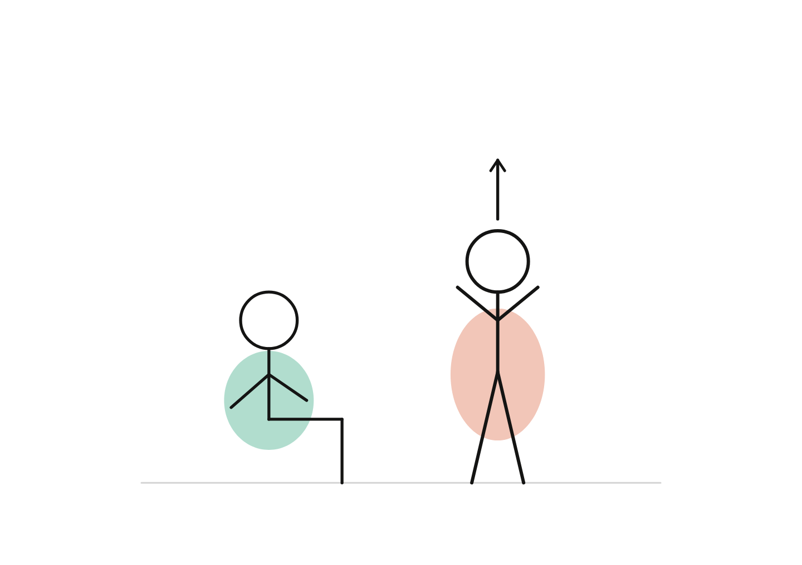
:::
:::::

## Wer seid ihr?

**Es steht auf wer…**

::::: columns
::: {.column width="60%"}
1.  … lieber Hörbücher/Podcasts hört, anstatt selbst zu lesen.
2.  … am besten/ liebsten nach 22 Uhr lernt.
3.  … bei Gruppenarbeiten tendenziell das Gefühl hat 80% der Arbeit allein zu machen.
4.  … schon einmal eine Datei Hausarbeit_final_FINAL_jetzt_wirklich_v2 (oder so ähnlich) genannt hat.
:::

::: {.column width="40%"}

:::
:::::

# Warum computergestützte Datenanalyse lernen?

## Wir sind umgeben von Daten

::::: columns
::: {.column width="70%"}
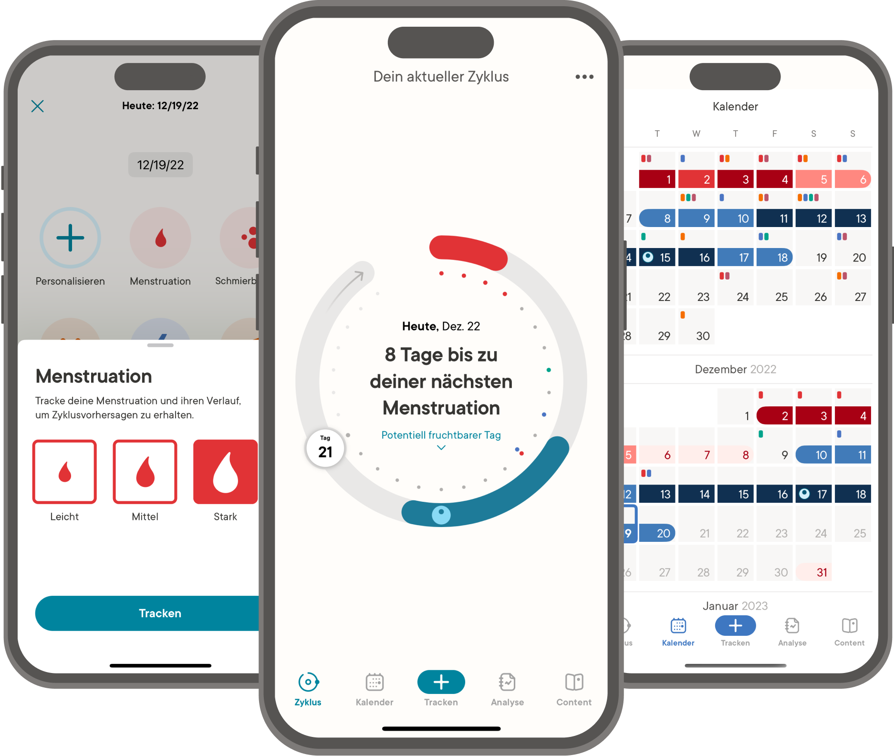{width="80%"}
:::

::: {.column width="30%"}
{width="80%"}
:::
:::::

## Daten helfen uns, soziale Phänomene zu begreifen

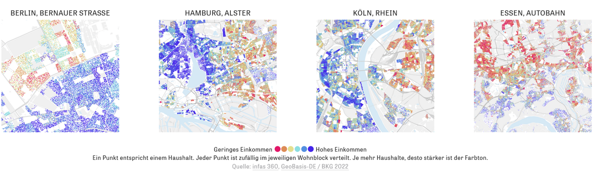

## Daten können aber auch täuschen

::::::: columns
:::: {.column width="50%"}
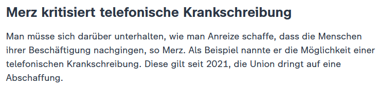

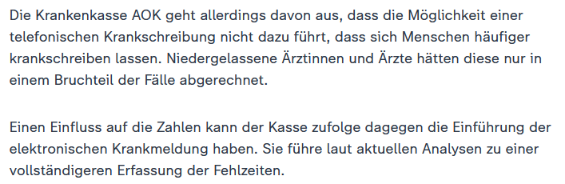

::: {style="font-size: 0.45em; color: gray; margin-top: auto;"}
Quelle: [ZDFheute, 17.01.2026](https://www.zdfheute.de/politik/deutschland/krankmeldung-krankenstand-merz-kritik-100.html)
:::
::::

:::: {.column width="50%"}
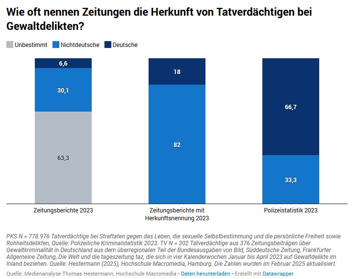

::: {style="font-size: 0.45em; color: gray; margin-top: auto;"}
Quelle: [Mediendienst Integration, 05.03.2026](https://mediendienst-integration.de/kriminalitaet/kriminalitaet-in-den-medien/berichten-medien-oefter-ueber-straftaten-von-auslaendern-als-von-deutschen/)
:::
::::
:::::::

## Die Menge zu überblickender Daten wird immer größer

::: {layout-ncol="2"}
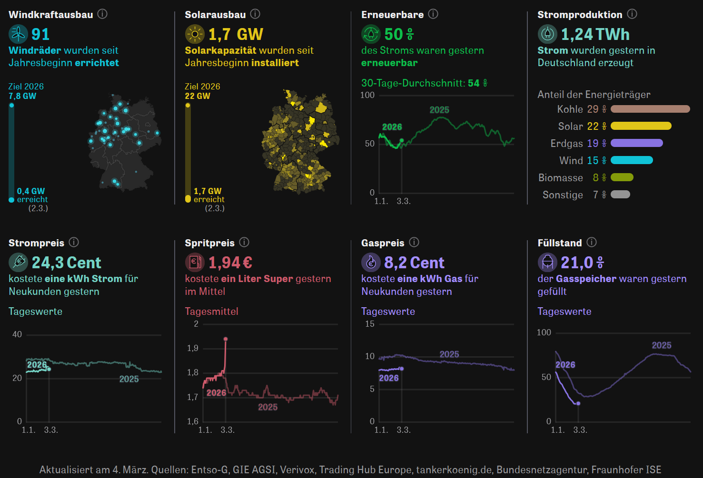

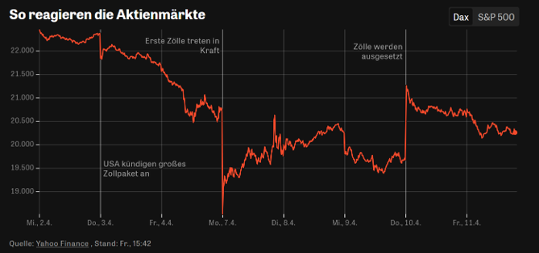
:::

## Datenkompetenz wird immer wichtiger

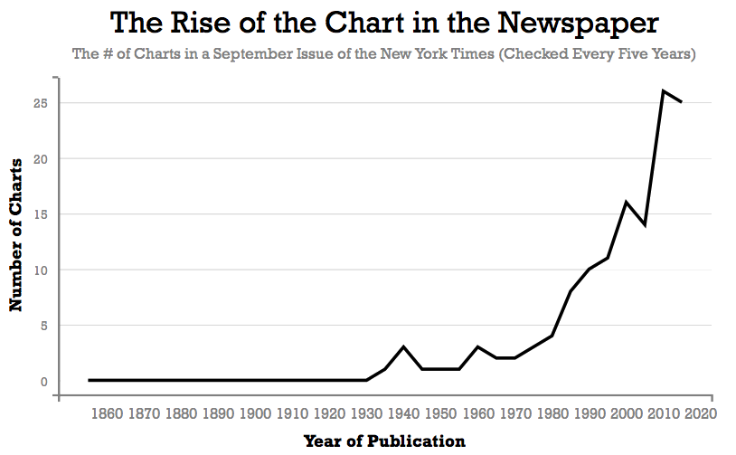

## Auch in der Politikwissenschaft

::: {layout-ncol="2"}
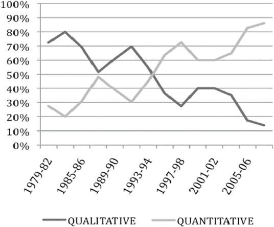

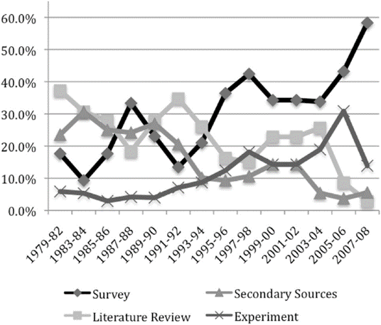
:::

::: {style="text-align: left; font-size: 0.5em;margin-top: -20px;"}
Quelle: Monroe, Kristen Renwick, William Chiu, Adam Martin und Bridgette Portman. 2009. What Is Political Psychology? Perspectives on Politics 7, Nr. 4 (Dezember): 859–882. doi:10.1017/S153759270999185X.
:::

# Aber warum ausgerechnet R für die computergestützte Datenanlyse nutzen?

::::: columns
::: {.column width="70%"}
:::

::: {.column width="30%"}

:::
:::::

## Gängige Statistik-Software

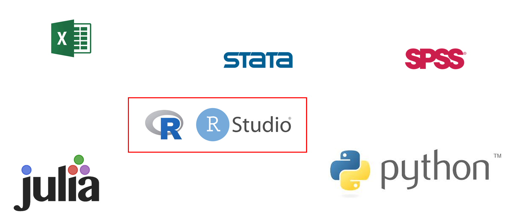

## 

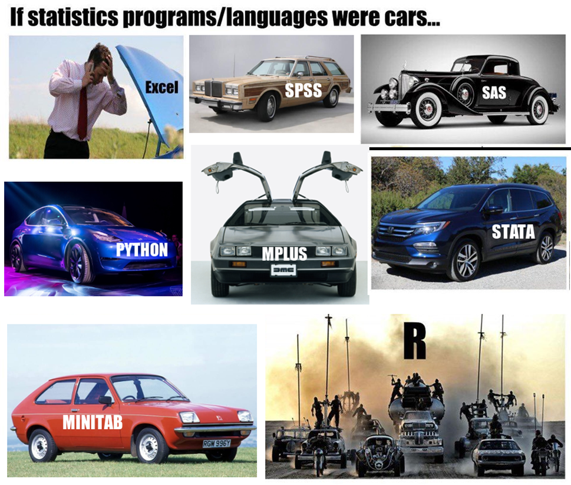{width="60%"}

## Warum R?

-   kostenlos & für alle zugänglich 
-   kann (fast) alles → flexibel erweiterbar mit Paketen 
-   reproduzierbar & transparent durch R-Skripte 
-   gut in andere Programme integrierbar 
-   versionierbar durch Git und GitHub 
-   open-source → große Community 
-   Programmierkenntnisse erforderlich, daher weniger nutzer\*innenfreundlich 

## R-Kenntnisse sind gefragt

::::: columns
::: {.column width="60%" style="font-size: 0.7em;"}
-   klassische Berufsfelder für PoWi-Absolvent\*innen: politische INstitutionen, Beratung, Verwaltung, Medien, NGOs, Projektmanagement ...
-   sie alle haben gemein, dass die Bedeutung evidenzbasierter und Entscheidungen zunimmt
-   R und Python für komplexe Datenanalysen
-   Zeitalter der AI → Data Science, Computational Science und maschinelles Lernen
:::

::: {.column width="40%" style="text-align: right"}
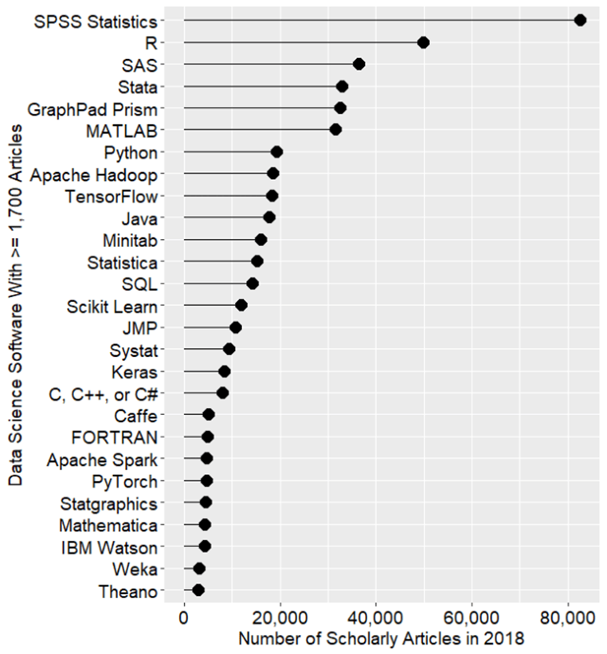
:::
:::::

# Was sind R und R-Studio eigentlich?

## Was sind R und R-Studio?

-   R ist eine Skriptsprache ( = „einfache“ Programmiersprache)
-   Ein Skript ist eine Abfolge von Befehlen
-   RStudio ist eine „Integrierte Entwicklungsumgebung” (integrated development environment,IDE) für die Programmiersprache R → eine Umgebung die das Arbeiten mit R erleichtert

:::::: fragment
::::: columns
::: {.column width="50%"}
{width="30%"}
:::

::: {.column width="50%"}
{width="50%"}
:::
:::::
::::::

## Was sind R und R-Studio?

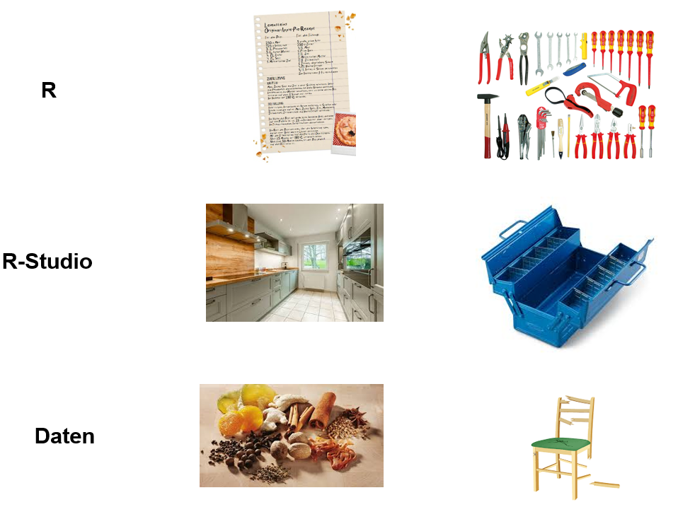

## Was sind R und R-Studio?

::: {layout-ncol="2"}
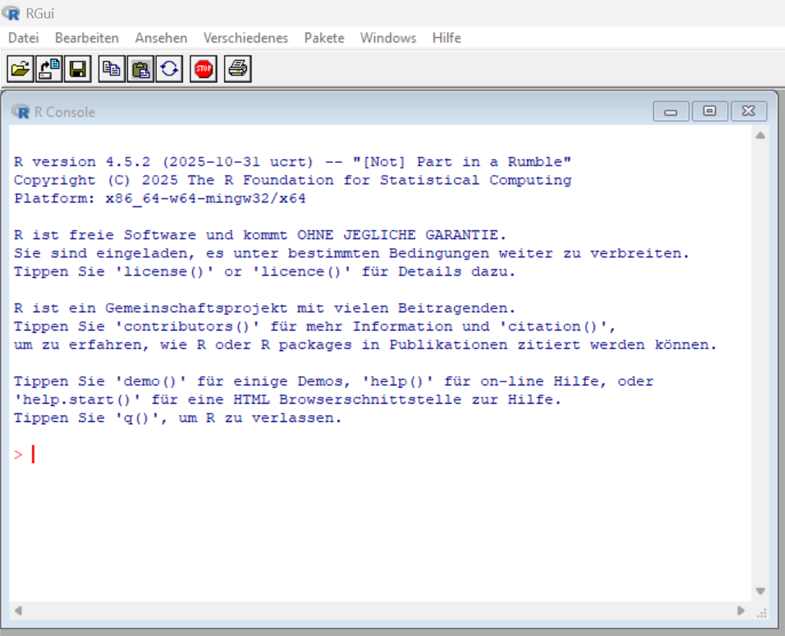

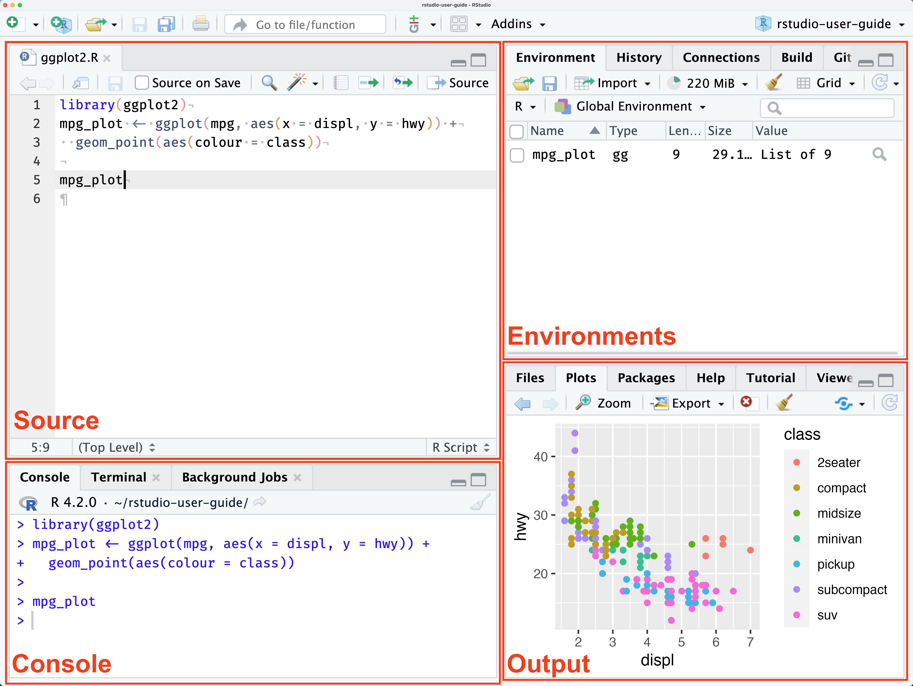
:::

## Die goldenen R-Regeln

:::: {layout-ncol="2"}
-   Alles ist möglich.\
-   Es gibt IMMER mehr als einen Weg zum Ziel
-   Gerade zu Beginn kann das Programmieren sehr frustrierend sein. Gib nicht auf! Frustrationstoleranz ist der Schlüssel!

::: fragment
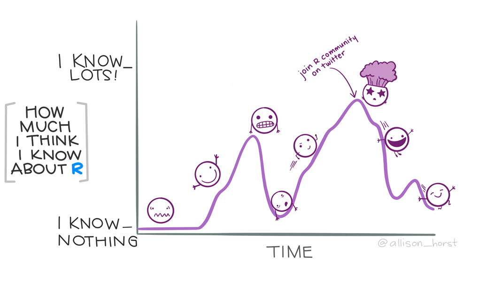
:::
::::

## Lernziel {.center}

> Erwerb der Fähigkeit, große Datensätze selbständig zu verarbeiten, den Daten und der Fragestellung entsprechende geeignete Analysen durchzuführen und deren Ergebnisse kompetent darzustellen und zu interpretieren.

## Dieser Kurs vermittelt:

-   Erlernen von:
    -   Datenaufbereitung (Bereinigung und Bearbeitung),
    -   Deskriptiver Datenanalyse,
    -   Erster statistischer Datenanalyse und
    -   Visualisierung und Darstellung
-   Praktische Anwendung durch Übungen

::: fragment
→ Übertragung auf kommende Lehrveranstaltungen, Hausarbeiten etc.
:::

## Ressourcen

-   Syllabus & Sitzungsplan
-   Zu erbringende Leistungen
-   Folien & Skripte
-   Übungen & Hausaufgaben
-   Literatur & Tipps

::: {.callout-important .fragment}
## Wichtig

All das steht euch auf der [Kurs-Webseite](https://maurakratz.github.io/quanti-methoden-website/) zur Verfügung!
:::

## Semesterübersicht

## Bis zur kommenden Sitzung bitte

-   R herunterladen & installieren
-   R-Studio herunterladen & installieren
-   mit dem Syllabus vertraut machen
-   etwaige Fragen notieren und zur nächsten Sitzung mitbringen

## R installieren

-   Download über Website des Cran-Projekts („The Comprehensive R Archive Network“): <https://cran.uni-muenster.de/> oder <https://cloud.r-project.org/>

    -   Download and Install R → entsprechende Betriebssystem auswählen (Windows, Mac oder Linux)

    -   install R for the first time → aktuelle R-Version zum Download auswählen bzw. bei Mac entweder Mac mit mind. M1 Chip oder mit Intel-Prozessor auswählen

-   Datei installieren (Standardeinstellungen können beibehalten werden)

## R installieren

::::: columns
::: {.column width="50%"}
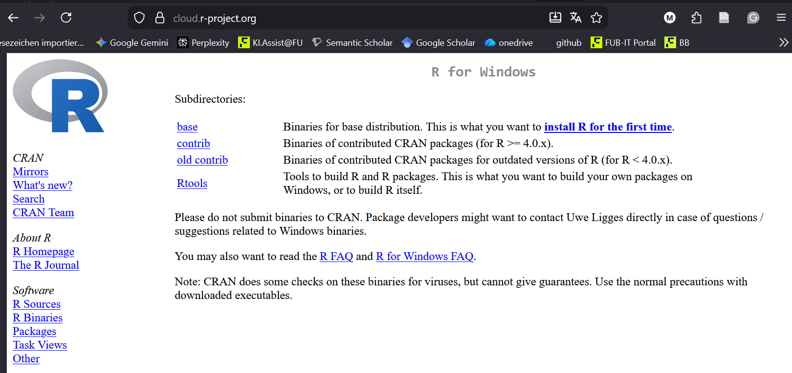

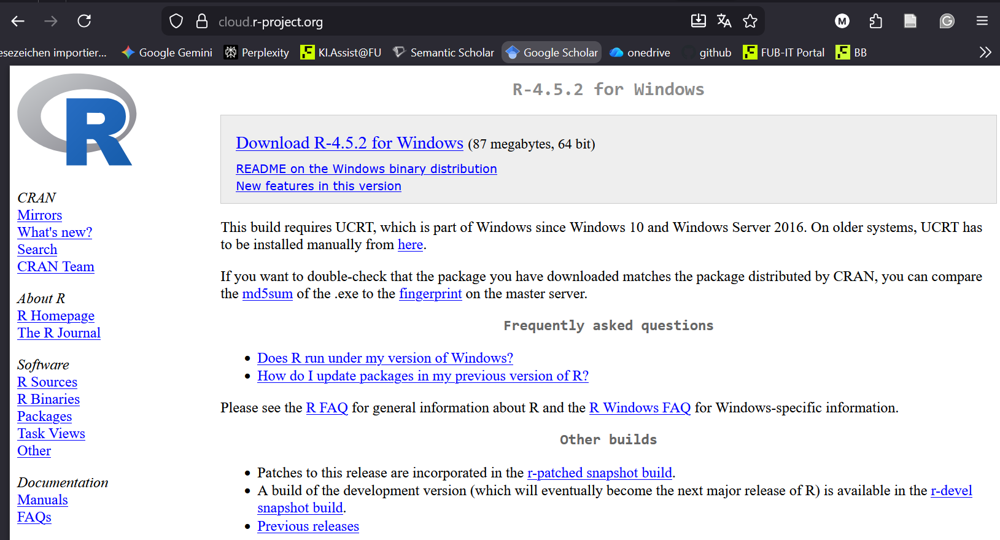
:::

::: {.column width="50%"}
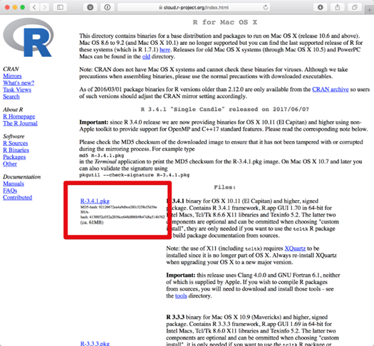
:::
:::::

## R-Studio installieren

-   Download über Website von RStudio: <https://rstudio.com/products/rstudio/download/>
-   RStudio Desktop (Free-Lizenz und entsprechendes Betriebssystem) auswählen
-   Datei installieren
-   RStudio starten

## R-Studio installieren

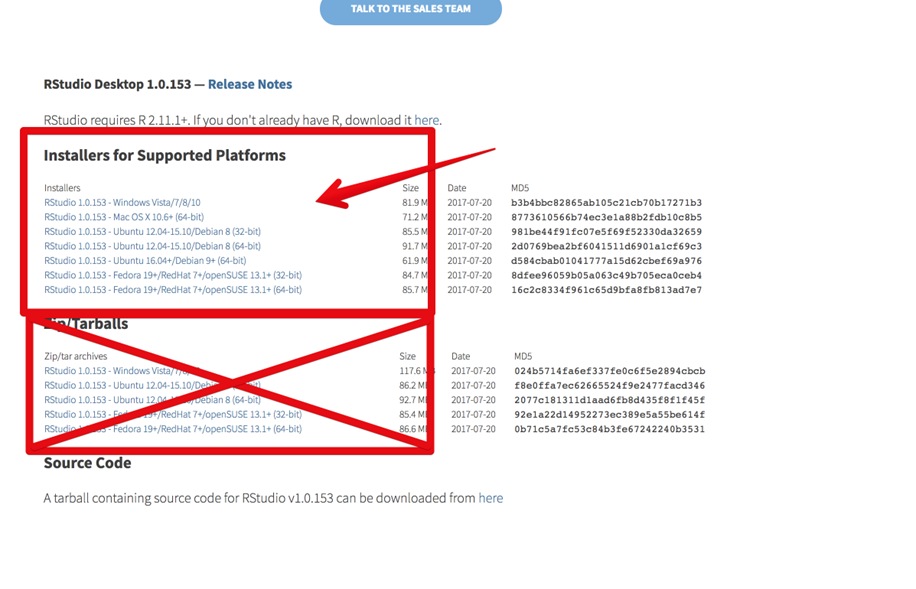

## R-Studio öffnen

Wenn du R-Studio das erste Mal öffnest, sieht es in etwa so aus:

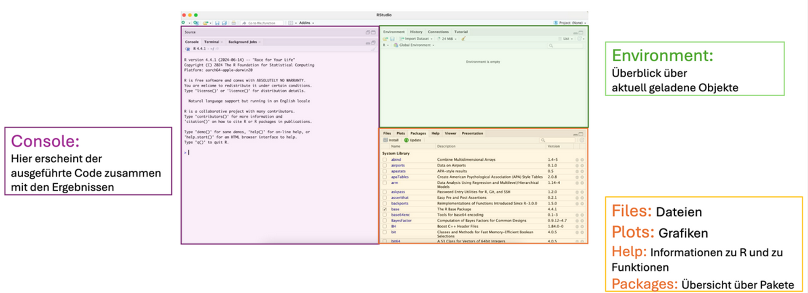

# Vielen Dank und bis kommenden Dienstag!

::: {style="margin-top: 4em;"}
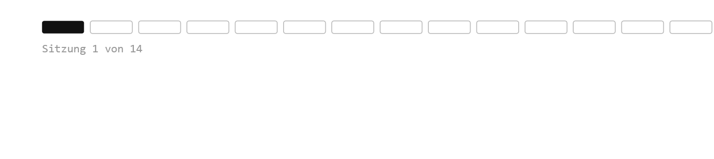
:::
