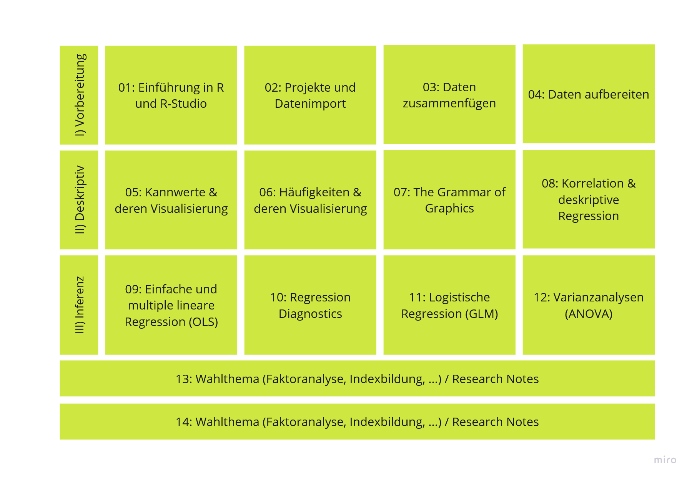
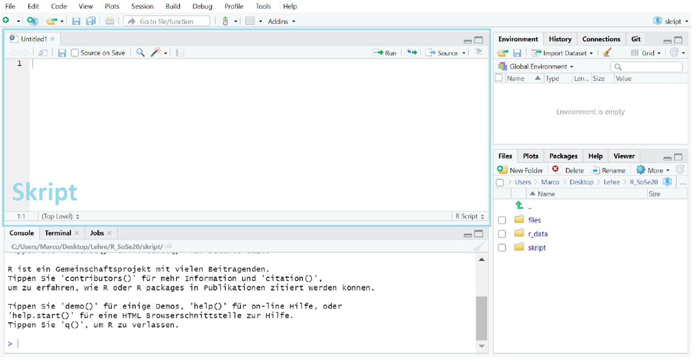
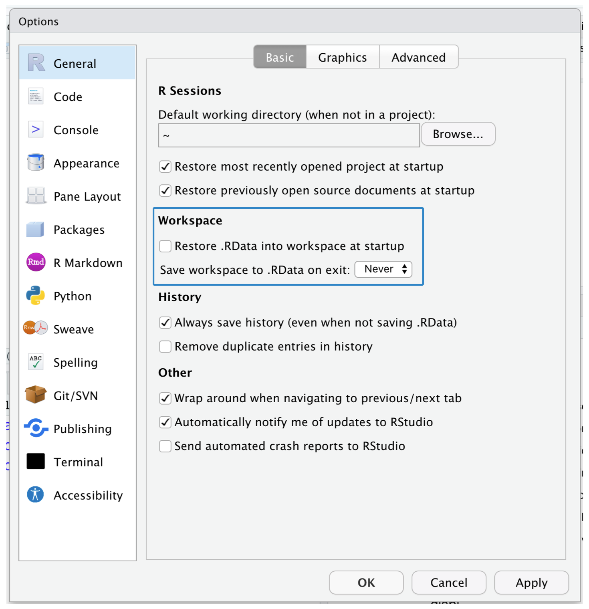
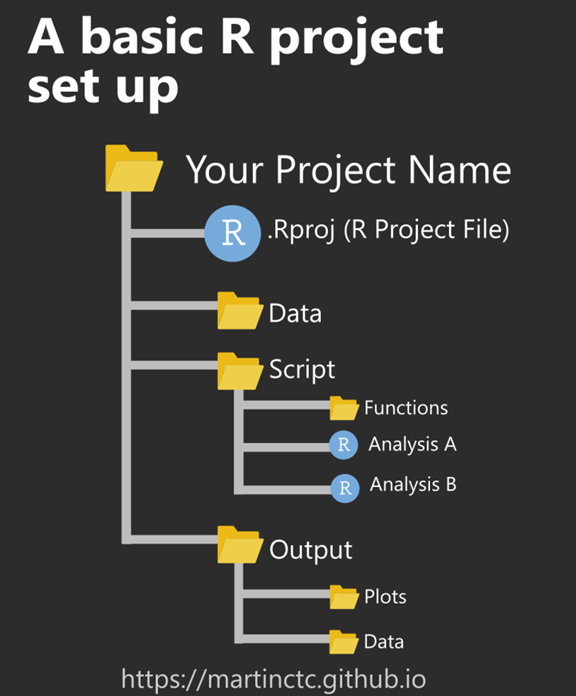
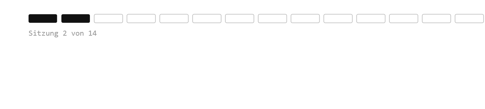

## Willkommen zurück!



# Was heute ansteht:

-   Check-In: Installation & Fragen
-   R-Studio-Oberfläche
    -   Einstellungen
    -   Hilfe
-   Projektordner anlegen
-   Basic R-Syntax & Nützliche Shortcuts
-   Hands-On: Daten einlesen

## Die R-Studio-Arbeitsumgebung

Bisher sieht es bei euch vermutlich etwa so aus:


## Die R-Studio-Arbeitsumgebung

Da wir in R-Studio aber immer mit Skripten arbeiten, sieht die Oberfläche typischerweise so aus:

{width="100%"}

## Einstellungen

::::: columns
::: {.column width="40%"}
-   Tools → Global Options
-   Bitte die Optionen zum Workspace deaktivieren: Häkchen nicht setzen und im drop-down-Menü "never" wählen
-   mehr Infos zu den Einstellungen im [User Guide](https://docs.posit.co/ide/user/)
:::

::: {.column .fragment width="60%" style="text-align: right"}

:::
:::::

## Ordner und Pfade

::::: columns
::: {.column style="width: 70%; font-size: 0.75em;"}
-   Wir müssen R sagen, wo es Datensätze einlesen und Ergebnisse ablegen soll
-   Dazu ist es sinnvoll in Projekten zu arbeiten (1 Projekt pro Kurs/ Hausarbeit/ Forschungsprojekt)
-   So müssen nicht immer lange, nicht reproduzierbare absolute Pfade angegeben werden
-   Und es muss nicht immer explizit der Arbeitsordner mit `setwd("Pfad-zum-Ordner")` festgelegt werden
-   Ein **Projekt** legt einen Ordner als Standard-Arbeitsordner fest
-   Von dort aus können dann unterschiedliche Unterordner mit relativen Pfaden angesteuert werden: 
```{r}
#| eval: false
#| echo: true
#| classes: fragment
data_1 <- rio::import("./data/dataset_1.csv")
```

:::

::: {.column .fragment style="width: 30%; text-align: right;"}
{width="100%"}
:::
:::::

## Die wichtigsten Keyboard-Shortcuts

-   `Str + Enter` führt Code aus. Dafür:

    -   entweder den auszuführenden Code markieren

    -   oder den Cursor irgendwo im auszuführenden Code-Chunk platzieren

-   `Str + Shift + S` führt das gesamte Skript aus.

-   `Str + Shift + M` fügt die Pipe (`%>%`) ein

-   `Str + Shift + L` räumt die Console auf

## Guter Stil im Skript

:::::: {style="display: flex; justify-content: space-between; align-items: flex-start;"}
::: {style="width: 70%;"}
1.  erkläre, was du tust in `# Kommentaren`

2.  benne Objekte ausschließlich mit Kleinbuchstaben und trenne Wörter mit `_`

    ```         
    i_use_snake_case 
    otherPeopleUseCamelCase 
    some.people.use.periods 
    And_aFew.People_RENOUNCEconvention
    ```

3.  unterteile dein Skript in Sektionen

    ```         
    # Load data --------------------------------------

    # Plot data --------------------------------------
    ```
:::

:::: {.fragment style="width: 25%;"}
::: callout-note
Mehr dazu

im [Tidyverse-Styleguide](https://style.tidyverse.org/) und im eBook [R For Data Science](https://r4ds.hadley.nz/workflow-style.html).
:::
::::
::::::

## Guter Stil im Code

1.  Leerzeichen vor Operatoren (außer `^`), vor `%>%` und vor `+` in ggplot2-Befehlen

2.  keine Leerzeichen vor oder nach Klammern

3.  neue Argumente/ Befehle kommen in eine neue Zeile

4.  Pipes sollten grundsätzlich das letzte in einer Codezeile sein

5.  eine Pipe sollte nicht länger als 10-15 Zeilen sein

## Basic R-Syntax

-   `#` für Kommentare, also Beschreibungen

-   `<-` um etwas einem R-Objekt zuzuweisen

-   `[]` um Positionen anzugeben

-   Durch Drücken der Tab-Taste erhältst du Vorschläge zur Vervollständigung

-   `%>%` bzw. Str. + Shift + M um mehrere Befehle mittels Pipe zu verketten

## Funktionen

`function_name(argument1 = value1, argument2 = value2, ...)`

## Nützliche Befehle

-   `ls()` zeigt alle Objekte

-   `rm()` für "remove" löscht ein Objekt

:::: fragment
::: callout-note
## Befehle ausführen

`Str + Enter` führt den Befehl aus. Dafür:

-   entweder den auszuführenden Code markieren

-   oder den Cursor irgendwo im auszuführenden Code-Chunk platzieren
:::
::::

:::: fragment
::: callout-note
## Skript ausführen

Str + Shift + S führt das gesamte Skript aus
:::
::::

## Wo bekomme ich Hilfe?

::::: columns
::: {.column width="60%"}
1.  Direkt in R-Studio

    -   `?befehl()`, z.B. `?mean()`

    -   `?paket`, z.B. `?dplyr`

    -   `??"stichwort"`, z.B. `??"mean"`

2.  Von Kommiliton\*innen

3.  Von mir während der Sitzung und/ oder in Sprechstunden
:::

::: {.column width="40%"}

:::
:::::

## Wo bekomme ich Hilfe ?

4.  Online

    -   bei RStudio/[Posit](https://support.posit.co/hc/en-us/articles/200552336-Getting-Help-with-R)
    -   über die von Google betriebene Suchmaschine [Rseek](https://www.rseek.org/)
    -   auf der [CRAN-Webseite](https://cran.r-project.org/) unter "Manuals" gibt es hilfreiche Einstiegshandbücher
    -   auf [Datacamp](https://www.datacamp.com/doc/r/r-tutorial) für einen schnellen Überblick über Basics
    -   in den Ressourcen im Syllabus


## Datenanalyse-Workflow

{style="display: block; margin: 0 auto;"}


# Hands On - Daten einlesen


## Minute Cards

Bitte füllt die Minute Cards für die heutige Sitzung aus. Das sollt enicht länger als 3 Minuten dauern. Vielen Dank für eure Mitarbeit!

```{r}
#| echo: false
library(qrcode)
qr <- qrcode::qr_code("https://forms.gle/xScN9nh3n2yjZXXK8")
plot(qr)
```

# Vielen Dank und bis kommenden Dienstag!

::: {style="margin-top: 1em;"}

:::

::: {style="display: flex; align-items: center; gap: 1em; "}
{style="width: 140px;"}

**Übung 1** zu "Daten einlesen" bis spätestens Sonntagabend!
:::
