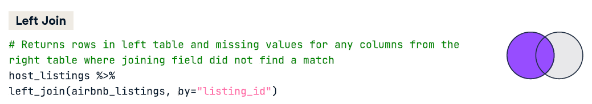
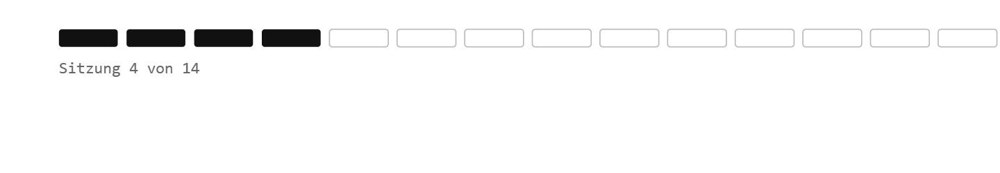

## Willkommen zurück!


# Was heute ansteht:

-   Check-In
-   Besprechung der Übung 2
-   Data Merging

# Recap

1.  Mit `dplyr::count()` und `dplyr::distinct()` die ersten Aggregationsbefehle 
2.  Zeilen filtern mit `dplyr::filter()` und logischen Operatoren (==) 
3.  `dplyr::filter(!is.na())` als Sonderform des filter()-Befehls 
4.  `dplyr::select()` um Spalten auszuwählen oder auszuschließen 
5.  Variablen überschreiben (oder neu erstellen) anhand bestimmter Konditionen mit `dplyr::mutate()` in Kombination mit `case_when()` 
6.  Datensatzausrichtung ändern mit tidyr::pivot_wider() oder `tidyr::pivot_longer()` 

## Datenanalyse-Workflow

{style="display: block; margin: 0 auto;"}

#  Feedback zu Übung 2

-   naming convention: uebung_01_name.R 

-   warum? `btw_2025_strukturdaten_neue_namen_ohne_fussnoten[, c("wknr", "wkname")]`

-   mit "Datensatz überschreiben" meine ich nicht `save()`, sondern `datensatz <- datensatz`

-   

    ```{r}
    #| echo: true 
    #| eval: false 

    btw_2025_struk_lander <- btw_2025_strukturdaten %>%
      dplyr::filter(wknr %in% c("901", "913", "902", "903", "904", "912", "915", "911", "905", "906", "907", "909", "910", "999")) %>% 
      View()
    ```

## Data merging 1 - Kombinieren

-   `dplyr::bind_cols()` um Spalten neben einander zu kleben

-   `dplyr::bind_rows()` um Zeilen untereinander zu kleben

-   `dplyr::union()` Zeilen aus zwei Tabellen untereinander kleben, aber dabei Duplikate löschen

:::: fragment
::: callout-note{
Diese `bind()`-Befehle führen Daten lediglich mechanisch zusammen, ohne beispielsweise unterschiedliche Sortierung der Spalten zu beachten oder Ähnliches.
:::
::::

## Data merging 2 - Joining

::: callout-note{
Anstatt Spalten einfach nebeneinander zu stellen, ohne die Sortierung zu beachten, verbindet ein `join` die Daten sinnvoll miteinander auf Grundlage der Übereinstimmung einer Schlüsselvariable.
:::



# Hands On - Daten mergen


## Variablen & Skalenniveaus

Die **abhängige Variable (AV)** ist diejenige Variable, deren Veränderung im Zusammenhang mit einer oder mehrerer **unabhängiger Variablen (UV)** gemessen wird.

Bsp.:

-   Konzentrationsfähigkeit der Studierenden  Temperatur im Raum

-   Leistung des Dozenten  Anwesenheit der Studierenden im Seminar?

-   Homeoffice  Arbeitsmotivation der Mitarbeiter\*innen

## Variablen und Skalenniveaus

| Skalenniveau | Variablentyp | Mögliche Aussagen | Beispiel(e) | Operationen |
|:-------------:|:-------------:|:--------------|:--------------|:-------------:|
| **Nominal** | Kategorial | Gleichheit / Verschiedenheit | Diagnosen, Religion | $=, \neq$ |
| **Ordinal** | Kategorial | Rangfolge | Schulabschlüsse | $=, \neq, <, >$ |
| **Intervall** | Metrisch | Abstände | Temperatur (°C), IQ | $+, -$ |
| **Verhältnis** | Metrisch | Verhältnisse | Einkommen, Alter | $*, /$ |

: {.striped .hover}

## Variablen und Skalenniveaus

-   in R lautet der entsprechende Befehl `class()`
-   das richtige Skalenniveau ist entscheidend für die spätere Durchführung von deskriptiver und schließender Statistik (ab kommender Sitzung)
-   daher schauen wir uns jetzt nochmal unsere Datensatzübersicht an und überlegen gemeinsam, welche Skalenniveaus geändert werden müssten.

{fig-align="center"}

## Minute Cards

Bitte füllt die Minute Cards für die heutige Sitzung aus. Das sollt enicht länger als 3 Minuten dauern. Vielen Dank für eure Mitarbeit!

```{r}
#| echo: false
library(qrcode)
qr <- qrcode::qr_code("https://forms.gle/xScN9nh3n2yjZXXK8")
plot(qr)
```

# Vielen Dank und bis kommenden Dienstag!

::: {style="margin-top: 1em;"}

:::

::: {style="display: flex; align-items: center; gap: 1em; "}
{style="width: 140px;"}

**Übung 3** zu "Data merging" bis spätestens Sonntagabend!
:::
