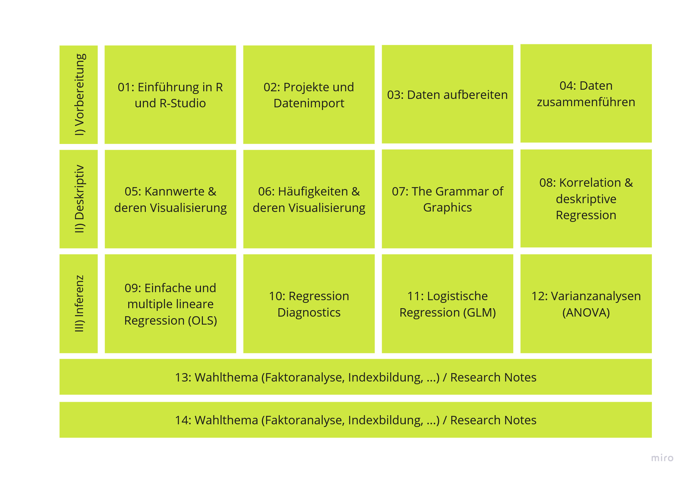
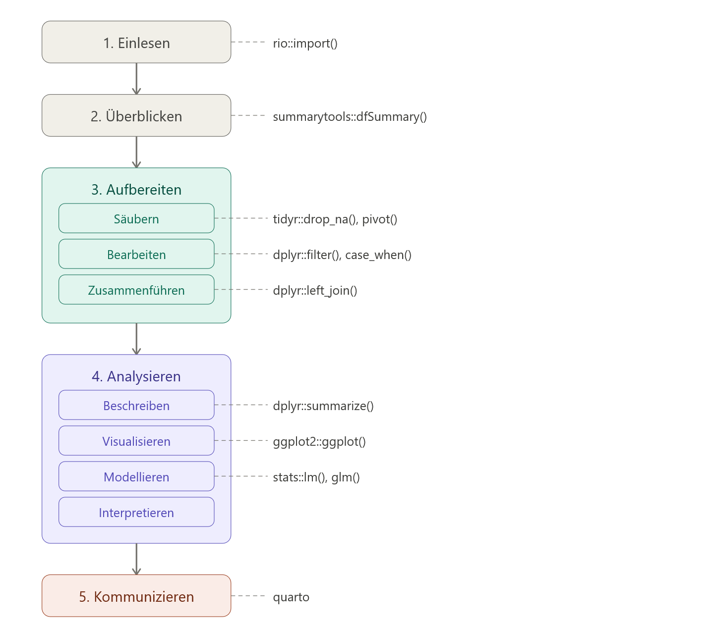
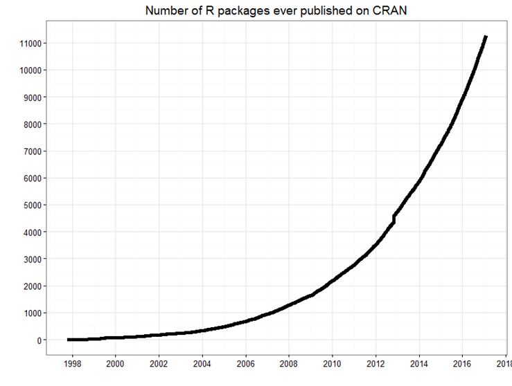
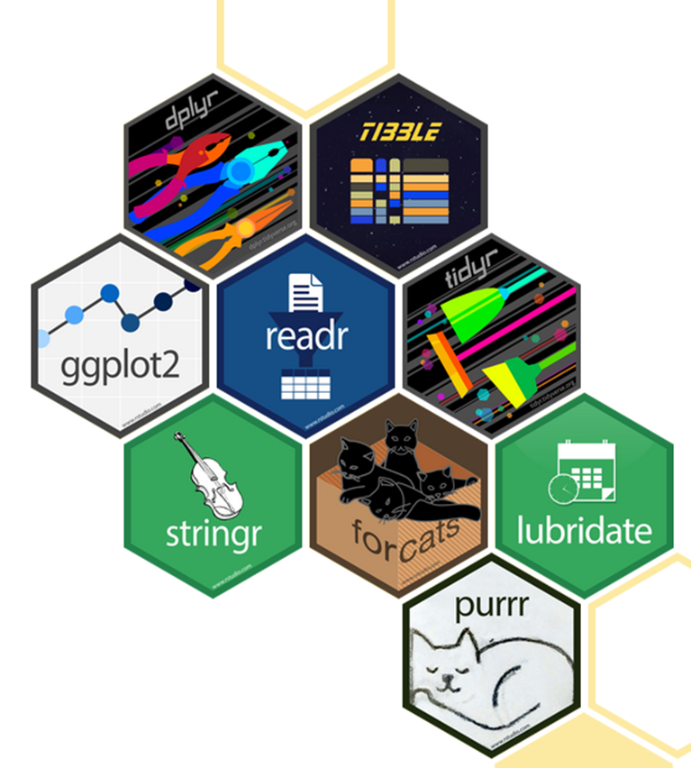
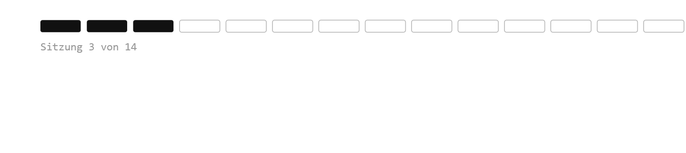

## Willkommen zurück!



# Was heute ansteht:

-   Check-In
-   Besprechung der Übung 2
-   Data Merging

# Recap

1.  ... 

## Datenanalyse-Workflow

{style="display: block; margin: 0 auto;"}

## Pakete

::::: columns
::: {.column width="50%"}
-   Einige Funktionen sind bereits in base R enthalten
-   Für andere müssen zusätzliche Pakete geladen werden
-   Pakete sind Bündel unterschiedlicher Funktionen
-   Base R reicht oft nur für sehr basale Operationen und Visualisierungen, für alles andere werden Pakete benötigt
:::

::: {.column width="50%"}

:::
:::::

## *summarytools*-Paket

| Funktion | Beschreibung | Geeignet für |
|------------------------|------------------------|------------------------|
| `dfSummary()` | Übersicht über alle Variablen (Klasse, fehlende Werte, Verteilungen, etc.) | Schnelle Gesamtübersicht eines Datensatzes |
| `freq()` | Häufigkeitstabellen | Einfache Verteilungen kategorialer Variablen |
| `descr()` | Deskriptive Statistik (Mittelwert, Median, SD, etc.) | Basisanalyse numerischer Variablen |
| `ctable()` | Kreuztabellen mit Prozenten und optionalen Tests (z. B. Chi²) | Zusammenhang zwischen zweikategorialen Variablen |

```{r}
#| eval: false
#| echo: true
btw_2025_ergebnisse %>%
  summarytools::dfSummary(na.col = FALSE) %>% # missings-Spalte ausblenden
  summarytools::view(file = "./data/btw_2025_ergebnisse_uebersicht.html") # speichern
```

# Das *tidyverse*-Paketbündel

:::: columns
::: {.column width="50%"}

:::
::::

## Pipes

-   Zwei Optionen: Base R pipe: `|>` ODER magrittr pipe: `%>%`
-   Die Default-Pipe kann über *Global Options* eingestellt werden
-   Zum Einfügen: eintippen oder `Strg + Shift + M`
-   Stilregeln:
    -   Immer Leerzeichen vor der Pipe
    -   Immer neue Zeile danach

```{r}
#| eval: false
#| echo: true
btw_2025_ergebnisse %>%
  dplyr::filter(jahr == 2025) %>%
  dplyr::select(partei, zweitstimmen)
```

## Datentransformation mit *dplyr*

| Befehl | Beschreibung | Bsp |
|------------------------|------------------------|------------------------|
| `rename()` | Spaltennamen ändern | `df %>% rename(neu = alt)` |
| `select()` | Variablen auswählen | `df %>% select(var1, var2)` |
| `slice()` | Zeilen nach Position auswählen | `df %>% slice(1:10)` |
| `filter()` | Zeilen nach Werten filtern | `df %>% filter(jahr == 2025)` |
| `arrange()` | Zeilen sortieren | `df %>% arrange(desc(stimmen))` |
| `relocate()` | Spaltenreihenfolge ändern | `df %>% relocate(var1, .before = var2)` |

## Datentransformation mit mit *dplyr*

| Befehl | Beschreibung | Bsp |
|------------------------|------------------------|------------------------|
| `mutate()` | Neue Variablen hinzufügen | `df %>% mutate(anteil = stimmen / sum(stimmen))` |
| `summarise()` | Mehrere Werte zusammenfassen | `df %>% summarise(mean(stimmen))` |
| `count()` | Häufigkeiten zählen | `df %>% count(partei)` |
| `group_by()` | Operationen gruppenweise ausführen | `df %>% group_by(partei) %>% summarise(mean(stimmen))` |

## Datentransformation mit mit *tidyr*

| Befehl | Beschreibung | Bsp |
|------------------------|------------------------|------------------------|
| `pivot_longer()` | Breites Format in langes umwandeln | `df %>% pivot_longer(cols = -id, names_to = "var", values_to = "val")` |
| `pivot_wider()` | Langes Format in breites umwandeln | `df %>% pivot_wider(names_from = var, values_from = val)` |
| `drop_na()` | Zeilen mit fehlenden Werten entfernen | `df %>% drop_na(var1)` |

# Hands On - Daten mergen


## Variablen & Skalenniveaus

Die **abhängige Variable (AV)** ist diejenige Variable, deren Veränderung im Zusammenhang mit einer oder mehrerer **unabhängiger Variablen (UV)** gemessen wird.

Bsp.:

-   Konzentrationsfähigkeit der Studierenden  Temperatur im Raum

-   Leistung des Dozenten  Anwesenheit der Studierenden im Seminar?

-   Homeoffice  Arbeitsmotivation der Mitarbeiter\*innen

## Variablen und Skalenniveaus

| Skalenniveau | Variablentyp | Mögliche Aussagen | Beispiel(e) | Operationen |
|:-------------:|:-------------:|:--------------|:--------------|:-------------:|
| **Nominal** | Kategorial | Gleichheit / Verschiedenheit | Diagnosen, Religion | $=, \neq$ |
| **Ordinal** | Kategorial | Rangfolge | Schulabschlüsse | $=, \neq, <, >$ |
| **Intervall** | Metrisch | Abstände | Temperatur (°C), IQ | $+, -$ |
| **Verhältnis** | Metrisch | Verhältnisse | Einkommen, Alter | $*, /$ |

: {.striped .hover}

## Minute Cards

Bitte füllt die Minute Cards für die heutige Sitzung aus. Das sollt enicht länger als 3 Minuten dauern. Vielen Dank für eure Mitarbeit!

```{r}
#| echo: false
library(qrcode)
qr <- qrcode::qr_code("https://forms.gle/xScN9nh3n2yjZXXK8")
plot(qr)
```

# Vielen Dank und bis kommenden Dienstag!

::: {style="margin-top: 1em;"}

:::

::: {style="display: flex; align-items: center; gap: 1em; "}
{style="width: 140px;"}

**Übung 3** zu "Data merging" bis spätestens Sonntagabend!
:::

