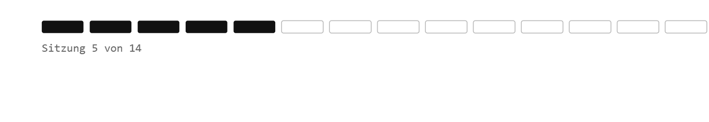

# Recap

1.  Struktur von Datensätzen überblicken und auf deren Kompatibilität hinarbeiten 

2.  Datensätze basierend auf einer gemeinsamen Schlüsselvariable zusammenführen mit `dplyr::left_join()` 

# Was heute ansteht:

-   Check-In
-   Besprechung der Übung 3
-   Kennwerte und Visualisierung
-   kurze Intro in Quarto

#  Feedback zu Übung 3

-   dar steht für daraus/darunter (also "Sonstige Parteien", "daraus BSW")
-   `filter()` und `select()` tun sehr unterschiedliche Dinge
-   `filter()`-Aufgabe kann unterschiedlich gelöst werden: `wahlkreis_nr > 900` oder `wahlkreis_name == "Land Insgesamt" | wahlkreis_name == "Insgesamt"` oder `dplyr::filter(wknr %in% c(901, 902, 903 ... ))`
-   in `case_when()` wurde `TRUE ~` durch `.default ~` ersetzt

## Exkurs CSV-Dateien

-   CSV steht für *Comma-Separated Values*, aber in der Praxis gibt es Varianten, die sich im verwendeten **Spalten- & Dezimaltrenner** unterscheiden:

    -   Englisches Format: Spalten durch `,` getrennt, Dezimalzahlen mit `.` (z.B. `1.5`)

    -   Deutsches Format: Spalten durch `;` getrennt, Dezimalzahlen mit `,` (z.B. `1,5`)

-   Das Format hängt von den **Systemeinstellungen** ab, mit denen die Datei gespeichert wurde

:::{ .fragment}

``` r
rio::import("daten.csv", sep = ";", dec = ",") # Deutsches csv-Format
rio::import("data.csv", sep = ",", dec = ".") # Englisches csv-Format
# Englisch ist der Standard in R und muss nicht explizit eingestellt werden.
```
::: 

## Exkurs Encoding

Das Encoding bestimmt wie Sonderzeichen gespeichert werden.

| Encoding | Typisch für           |
|----------|-----------------------|
| `UTF-8`  | Mac, moderne Tools    |
| `latin1` | Älteres Windows/Excel |

Wenn Umlaute als `ü` erscheinen ist das Encoding falsch.

``` r
rio::import("datei.csv", sep = ";", dec = ",",
         encoding = "latin1")
```

::: callout-tip
Im Zweifel Datei kurz in RStudio öffnen und nachschauen!
:::

## Willkommen zurück!

:::::: columns
::: {.column width="70%"}

:::

:::: {.column width="30%"}
::: {.fragment style="font-size: 0.75em;"}
Spannende Fragen an Daten lassen sich meistens zwei Polen zuordnen:

1.  Variation einer Variable (Kennwerte, Sitzung 5 & Häufigkeiten, Sitzung 06)
2.  Kovariation zweier Variablen (Zusammenhänge, Sitzung 08)
:::
::::
::::::

## Voraussetzungen und Vokabeln

-   Qualitative & quantitative, diskrete & stetige, latente & manifeste, unabhängige & abhängige Variablen

-   Variable, Ausprägung, Fall

-   Skalierung (definiert mögl. Ausprägungen):

    -   Nominalskala

    -   Ordinalskala

    -   Intervallskala

    -   Verhältnisskala

## Voraussetzungen und Vokabeln

-   Lagemaße

    -   Modus
    -   Mittelwert (arithmetisches Mittel)
    -   Median

-   Streuungsmaße

    -   Spannweite (range)
    -   Quartile, Interquartilsabstand (IQR)
    -   Varianz, bzw. Standardabweichung
    -   Mittlere absolute Abweichung vom Median (Median Absolute Deviation, MAD)

## Skalenniveaus

:::: {style="font-size: 0.75em;"}
| Skalenniveau | Mögliche Aussagen | Beispiel(e) | Zulässige Operationen |
|------------------|------------------|------------------|------------------|
| kategorial · **Nominalskala** | Gleichheit / Verschiedenheit | Diagnosen, Religion, Parteipräferenz | `=, ≠` |
| kategorial · **Ordinalskala** | … & Rangfolge | Schulabschlüsse, Zustimmungswerte (Likert-Skala) | `=, ≠, <, >` |
| metrisch · **Intervallskala** | … & Interpretierbare Abstände | Temperatur in °C, Kalenderjahre, IQ | `=, ≠, <, >, +, −` |
| metrisch · **Verhältnisskala** | … & Absoluter Nullpunkt & interpretierbare Verhältnisse | Einkommen in Euro, Körpergröße in cm, Alter in Jahren | `=, ≠, <, >, +, −, ×, ÷` |

: {tbl-colwidths="\[20,30,30,20\]"}

::: callout-tip
Je höher das Skalenniveau, desto mehr mathematische Operationen sind zulässig.
:::
::::

## Skalenniveau

```{=html}
<style>
  #skalen-tabelle th,
  #skalen-tabelle td { border-top: none; border-bottom: none; }
  #skalen-tabelle td.border-left { border-left: 2px solid #ccc !important; }
</style>
<table id="skalen-tabelle" style="width:100%; border-collapse:collapse; font-size:0.75em;">
  <thead>
    <tr>
      <th></th>
      <th colspan="3" style="text-align:center; color:gray; font-weight:400; border-bottom:1px solid #ccc !important;">Lagemaße</th>
      <th colspan="3" style="text-align:center; color:gray; font-weight:400; border-bottom:1px solid #ccc !important; border-left:2px solid #ccc !important;">Streuungsmaße</th>
    </tr>
    <tr>
      <th style="text-align:left;">Skalenniveau</th>
      <th>Modus</th><th>Median</th><th>Mittelwert</th>
      <th class="border-left">Spannweite</th>
      <th>IQR</th>
      <th>Varianz & SD</th>
    </tr>
  </thead>
  <tbody>
    <tr>
      <td>Nominal</td>
      <td style="text-align:center;color:#3a7d44;font-style:italic;">ja</td>
      <td style="text-align:center;color:#c0392b;font-style:italic;">nein</td>
      <td style="text-align:center;color:#c0392b;font-style:italic;">nein</td>
      <td class="border-left" style="text-align:center;color:#c0392b;font-style:italic;">nein</td>
      <td style="text-align:center;color:#c0392b;font-style:italic;">nein</td>
      <td style="text-align:center;color:#c0392b;font-style:italic;">nein</td>
    </tr>
    <tr>
      <td>Ordinal</td>
      <td style="text-align:center;color:#3a7d44;font-style:italic;">ja</td>
      <td style="text-align:center;color:#3a7d44;font-style:italic;">ja</td>
      <td style="text-align:center;color:#c0392b;font-style:italic;">nein</td>
      <td class="border-left" style="text-align:center;color:#3a7d44;font-style:italic;">ja</td>
      <td style="text-align:center;color:#3a7d44;font-style:italic;">ja</td>
      <td style="text-align:center;color:#c0392b;font-style:italic;">nein</td>
    </tr>
    <tr>
      <td>Intervall</td>
      <td style="text-align:center;color:#3a7d44;font-style:italic;">ja</td>
      <td style="text-align:center;color:#3a7d44;font-style:italic;">ja</td>
      <td style="text-align:center;color:#3a7d44;font-style:italic;">ja</td>
      <td class="border-left" style="text-align:center;color:#3a7d44;font-style:italic;">ja</td>
      <td style="text-align:center;color:#3a7d44;font-style:italic;">ja</td>
      <td style="text-align:center;color:#3a7d44;font-style:italic;">ja</td>
    </tr>
    <tr>
      <td>Verhältnis</td>
      <td style="text-align:center;color:#3a7d44;font-style:italic;">ja</td>
      <td style="text-align:center;color:#3a7d44;font-style:italic;">ja</td>
      <td style="text-align:center;color:#3a7d44;font-style:italic;">ja</td>
      <td class="border-left" style="text-align:center;color:#3a7d44;font-style:italic;">ja</td>
      <td style="text-align:center;color:#3a7d44;font-style:italic;">ja</td>
      <td style="text-align:center;color:#3a7d44;font-style:italic;">ja</td>
    </tr>
  </tbody>
</table>
```

# Hands On - Daten aggregieren


## Datentransformation mit mit *dplyr*

| Befehl | Beschreibung | Bsp |
|------------------------|------------------------|------------------------|
| `mutate()` | Neue Variablen hinzufügen | `df %>% mutate(anteil = stimmen / sum(stimmen))` |
| `summarise()` | Mehrere Werte zusammenfassen | `df %>% summarise(mean(stimmen))` |
| `count()` | Häufigkeiten zählen | `df %>% count(partei)` |
| `group_by()` | Operationen gruppenweise ausführen | `df %>% group_by(partei) %>% summarise(mean(stimmen))` |

## Datentransformation mit mit *dplyr*

::: callout-tip
`dplyr::count()` zählt wie viele Zeilen pro Gruppe vorhanden sind. `count(land)` ist eine Abkürzung für `group_by(land) %>% summarise(n = n())`. Gibt immer eine Spalte mit Häufigkeitszählungen namens n zurück.

`dplyr::n()` zählt die Anzahl Zeilen in der aktuellen Gruppe — aber nur innerhalb von `summarise()`, `mutate()` oder `filter()`. Kann nicht alleinstehend aufgerufen werden.
:::

## Minute Cards

Bitte füllt die Minute Cards für die heutige Sitzung aus. Das sollt enicht länger als 3 Minuten dauern. Vielen Dank für eure Mitarbeit!

```{r}
#| echo: false
library(qrcode)
qr <- qrcode::qr_code("https://forms.gle/xScN9nh3n2yjZXXK8")
plot(qr)
```

# Vielen Dank und bis kommenden Dienstag!

::: {style="margin-top: 1em;"}
]()
:::

::: {style="display: flex; align-items: center; gap: 1em; "}
{style="width: 140px;"}

**Übung 4** zu "Daten Aggregieren" bis spätestens Sonntagabend!
:::
