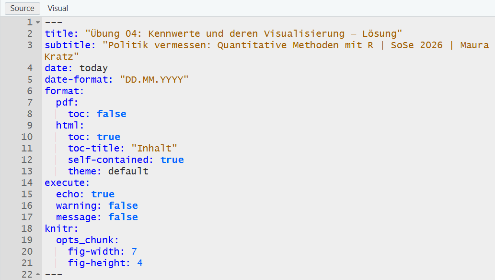
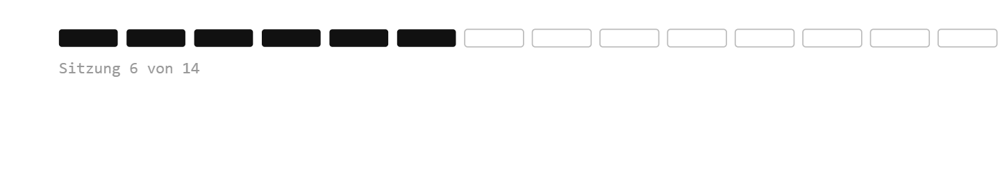

## Willkommen zurück!

:::::: columns
::: {.column width="70%"}

:::

:::: {.column width="30%"}
::: {.fragment style="font-size: 0.75em;"}
Spannende Fragen an Daten lassen sich meistens zwei Polen zuordnen:

1.  Variation einer Variable (Kennwerte, Sitzung 5 & Häufigkeiten, Sitzung 06)
2.  Kovariation zweier Variablen (Zusammenhänge, Sitzung 08)
:::
::::
::::::

## Variation untersuchen - 1 Variable {.smaller}

| Skalenniveau | Ziel / Frage | Kennwert / Tabelle | R-Funktion |
|------------------|------------------|------------------|--------------------|
| Kategorial | Häufigkeiten | Häufigkeitstabelle | `dplyr::count()` · `questionr::freq` |
| Kategorial | Anteile | Relative Häufigkeiten | `dplyr::mutate(pct = n / sum(n) * 100)` |
| Metrisch | Zentrale Tendenz | Mittelwert · Median | `dplyr::summarise()` + `mean()` · `median()` |
| Metrisch | Streuung | SD · Varianz · IQR | `sd()` · `var()` · `IQR()` |
| Metrisch | Wertebereich | Min · Max | `min()` · `max()` |
| Metrisch | Überblick | Alle Kennwerte | `skimr::skim()` |

## Visualisierung - 1 Variable

::: {style="font-size: 0.75em;"}
| Skalenniveau | Ziel / Frage          | Visualisierung | ggplot2            |
|--------------|-----------------------|----------------|--------------------|
| Kategorial   | Häufigkeit/Verteilung | Balkendiagramm | `geom_bar()`       |
| Metrisch     | Verteilung            | Histogramm     | `geom_histogram()` |
| Metrisch     | Streuung / Ausreißer  | Boxplot        | `geom_boxplot()`   |
:::

::: callout-tip
Mit der Visualisierung mit ggplot2 beschäftigen wir uns in Sitzung 7 ausführlicher!
:::

# Recap

1.  Kennwerte in R berechnen
2.  Boxplots
3.  Code, Output und Interpretation mit Quarto in einem Dokument (z.B. PDF) zusammenbringen

::: {.callout-tip .fragment}
## Kennwerte

-   Lagemaße: Modus; Mittelwert (arithmetisches Mittel); Median; ...

-   Streuungsmaße: Spannweite (range); Quartile, Interquartilsabstand (IQR); Varianz, bzw. Standardabweichung; ...
:::

## Boxplots

```{r}
#| label: boxplot-alter
#| echo: false
#| fig-width: 10
#| fig-height: 4.5
#| out-width: "100%"

library(tidyverse)
library(patchwork)

set.seed(42)
n <- 40

col_box      <- "#378ADD"
col_box_fill <- "#E6F1FB"
col_med      <- "#185FA5"
col_mean     <- "#D85A30"
col_pts      <- "#888780"

dat <- dplyr::bind_rows(
  tibble(gruppe = "Symmetrisch",  alter = round(rnorm(n, mean = 24, sd = 2.5))),
  tibble(gruppe = "Rechtsschief", alter = round(c(rnorm(n * 0.85, mean = 22, sd = 1.2), runif(n * 0.15, min = 29, max = 38)))),
  tibble(gruppe = "Linksschief",  alter = round(c(rnorm(n * 0.85, mean = 28, sd = 1.5), runif(n * 0.15, min = 18, max = 21)))),
  tibble(gruppe = "Bimodal",      alter = round(c(rnorm(n / 2, mean = 21, sd = 1.2), rnorm(n / 2, mean = 27, sd = 1.2))))
) %>%
  dplyr::mutate(gruppe = factor(gruppe,
    levels = c("Symmetrisch", "Rechtsschief", "Linksschief", "Bimodal")))

theme_slide <- function() {
  theme_minimal(base_size = 11) +
    theme(
      panel.grid.major.x = element_blank(),
      panel.grid.minor   = element_blank(),
      panel.grid.major.y = element_line(color = "#D3D1C7", linewidth = 0.4),
      axis.title.x       = element_blank(),
      axis.text.x        = element_blank(),
      axis.ticks.x       = element_blank(),
      axis.title.y       = element_text(color = "#5F5E5A", size = 9),
      axis.text.y        = element_text(color = "#5F5E5A", size = 9),
      plot.title         = element_text(size = 11, face = "bold", color = "#2C2C2A"),
      plot.subtitle      = element_text(size = 8.5, color = "#5F5E5A"),
      plot.margin        = margin(8, 8, 4, 8)
    )
}

make_panel <- function(data, titel, subtitle = "") {
  med <- median(data$alter)
  mw  <- mean(data$alter)
  ggplot(data, aes(x = 0, y = alter)) +
    geom_jitter(width = 0.18, alpha = 0.55, size = 1.8, color = col_pts) +
    geom_boxplot(
      width = 0.35, outlier.shape = 1,
      outlier.color = "#A32D2D", outlier.size = 2.5,
      fill = col_box_fill, color = col_box,
      linewidth = 0.6, coef = 1.5, fatten = NULL
    ) +
    geom_segment(aes(x = -0.175, xend = 0.175, y = med, yend = med),
      color = col_med, linewidth = 1.4) +
    geom_point(aes(x = 0, y = mw),
      shape = 23, size = 3, fill = col_mean, color = col_mean) +
    scale_x_continuous(limits = c(-0.5, 0.5)) +
    scale_y_continuous(limits = c(17, 40), breaks = seq(18, 40, by = 4)) +
    labs(title = titel, subtitle = subtitle, y = "Alter (Jahre)") +
    theme_slide()
}

p1 <- make_panel(dplyr::filter(dat, gruppe == "Symmetrisch"),  "Symmetrisch",  "Median ≈ Mittelwert")
p2 <- make_panel(dplyr::filter(dat, gruppe == "Rechtsschief"), "Rechtsschief", "Mittelwert > Median")
p3 <- make_panel(dplyr::filter(dat, gruppe == "Linksschief"),  "Linksschief",  "Mittelwert < Median")
p4 <- make_panel(dplyr::filter(dat, gruppe == "Bimodal"),      "Bimodal",      "Box verdeckt Zweigipfligkeit")

(p1 | p2 | p3 | p4) +
  plot_annotation(
    caption = "— Median  |  ◆ Mittelwert  |  Kasten = IQR (mittlere 50 %)  |  Whisker = 1.5 × IQR  |  ○ Ausreißer  |  Punkte = Einzelbeobachtungen",
    theme = theme(plot.caption = element_text(size = 7.5, color = "#5F5E5A", hjust = 0))
  )
```

# Was heute ansteht:

-   Check-In: Fragen zu Quarto, Kennwerten etc.
-   Besprechung der Übung 4
-   Häufigkeiten und Visualisierung

## "Base R"

-   Die Installation von R enthält automatisch eine Sammlung von Paketen, die als Standard-R-Distribution (oft informell auch als „Base R“ im weiteren Sinne oder Core R) bezeichnet werden
-   15 Basispakete werden beim Start von R automatisch geladen (z. B. base, stats, graphics)
-   15 empfohlene Pakete werden Installation automatisch mitgeliefert, sind aber nicht automatisch geladen.

::: {.callout-tip .fragment}
Auch diese "Base-R"-Funktionen werden als bei Masking-Konflikten überschrieben, wenn wir sie nicht refernzieren, wie beispielsweise mit stats::summary().
:::

## Quarto {.smaller}

-   Dokumentenformat, das R-Code und Text kombiniert

-   YAML-Header: Titel, Format, Globale Chunk-Optionen

::: fragment
{width="70%"}
:::

## Quarto {.smaller}

-   Markdown Text

    | Element       | Syntax                      | Ergebnis             |
    |---------------|-----------------------------|----------------------|
    | Überschrift 1 | `# Titel`                   | Große Überschrift    |
    | Überschrift 2 | `## Abschnitt`              | Mittlere Überschrift |
    | Überschrift 3 | `### Unterabschnitt`        | Kleine Überschrift   |
    | Fett          | `**Text**`                  | **Text**             |
    | Kursiv        | `*Text*`                    | *Text*               |
    | Code inline   | `` `code` ``                | `code`               |
    | Aufzählung    | `- Punkt`                   | Aufzählung           |
    | Nummeriert    | `1. Punkt`                  | Nummerierte Liste    |
    | Leerzeile     | Leerzeile zwischen Absätzen | Neuer Absatz         |

## Quarto {.smaller}

-   Chunk-Optionen steuern, was im gerenderten Dokument erscheint. Die lokal gesetzten Chunk-Optionen überschreiben ggf. die globalen Chunk-Optionen im yaml-header. Sie werden mit `#|` direkt am Anfang des Chunks eingetragen

    | Option    | Default | `false` bewirkt                              |
    |-----------|---------|----------------------------------------------|
    | `echo`    | `true`  | Code wird *nicht* angezeigt, Output schon    |
    | `eval`    | `true`  | Code wird *nicht* ausgeführt, aber angezeigt |
    | `output`  | `true`  | Output wird *nicht* angezeigt, Code schon    |
    | `warning` | `true`  | Warnungen werden *nicht* angezeigt           |
    | `message` | `true`  | Meldungen werden *nicht* angezeigt           |
    | `include` | `true`  | *Weder* Code *noch* Output werden angezeigt  |

## Quarto

-   Quarto sucht Dateien standardmäßig relativ zur `.qmd`-Datei, nicht zum Projektordner. `here::here()` verweist immer auf den Projektordner (dort wo die `.Rproj`-Datei liegt):

    ``` r
    # so:
    load(here::here("output/btw_2025_strukturdaten.RData"))

    # statt so:
    load("output/btw_2025_strukturdaten.RData")
    ```

#  Feedback zu Übung 4

-   Konntet ihr die .qmd alle herunterladen?
-   Entschuldigt die Verwirrung mit `wb`-Objekt in Aufgabe 5
-   Interpretation geht über bloße Nennung hinaus
-   Zwei häufige Probleme beim Rendering:
    -   Es fehlt der gesamte Header (Wieso?)
    -   es fehlt die LaTeX-Klasse scrartcl (aus dem KOMA-Script-Paket): `tinytex::tlmgr_install("koma-script")` `tinytex::uninstall_tinytex()` `tinytex::install_tinytex()`

## kategoriale und kontinuierliche Variablen

-   die meisten Kennwerte ergeben nur für metrische Variablen Sinn
-   diese können wir aber dann nach kategorialen Variaben gruppiert ausgeben
-   z.B. Mittelwert der Körpergröße nach Geschlecht, Mittleres Einkommen nach Bildungsabschluss etc.
-   bei kategorialen Variablen können Häufigkeiten gezählt werden

# Hands On - Häufigkeitszählungen


## Minute Cards

Bitte füllt die Minute Cards für die heutige Sitzung aus. Das sollt enicht länger als 3 Minuten dauern. Vielen Dank für eure Mitarbeit!

```{r}
#| echo: false
library(qrcode)
qr <- qrcode::qr_code("https://forms.gle/xScN9nh3n2yjZXXK8")
plot(qr)
```

# Vielen Dank und bis kommenden Dienstag!

::: {style="margin-top: 1em;"}

:::

::: {style="display: flex; align-items: center; gap: 1em; "}
{style="width: 140px;"}

**Übung 5** zu "Häufigkeiten" bis spätestens Sonntagabend!
:::


