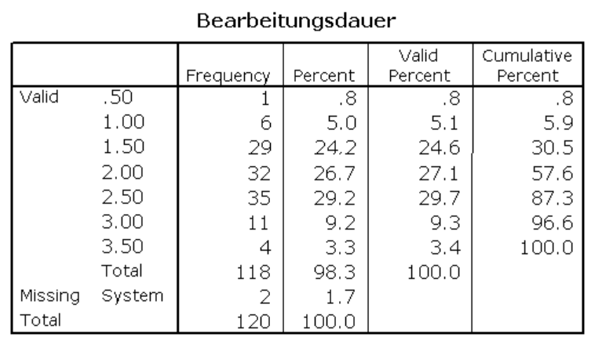

## Willkommen zurück!

:::::: columns
::: {.column width="70%"}

:::

:::: {.column width="30%"}
::: {.fragment style="font-size: 0.75em;"}
Spannende Fragen an Daten lassen sich meistens zwei Polen zuordnen:

1.  Variation einer Variable (Kennwerte, Sitzung 5 & Häufigkeiten, Sitzung 06)
2.  Kovariation zweier Variablen (Zusammenhänge, Sitzung 08)
:::
::::
::::::

## Variation untersuchen - 1 Variable {.smaller}

| Skalenniveau | Ziel / Frage | Kennwert / Tabelle | R-Funktion |
|------------------|------------------|------------------|------------------|
| Kategorial | Häufigkeiten | Häufigkeitstabelle | `dplyr::count()` · `count()` |
| Kategorial | Anteile | Relative Häufigkeiten | `dplyr::mutate(pct = n / sum(n) * 100)` |
| Metrisch | Zentrale Tendenz | Mittelwert · Median | `dplyr::summarise()` + `mean()` · `median()` |
| Metrisch | Streuung | SD · Varianz · IQR | `sd()` · `var()` · `IQR()` |
| Metrisch | Wertebereich | Min · Max | `min()` · `max()` |
| Metrisch | Überblick | Alle Kennwerte | `skimr::skim()` |

# Recap

::::: columns
::: {.column width="40%"}
1.  Häufigkeitstabellen mit dplyr::count() und mit questionr::freq()

2.  kontinuierliche Variablen klassieren

::: {.callout-tip .fragment}
Faktoren = spezieller Vektortyp, bzw. Variablenklasse, die es erlaubt einen Wert plus sein Label zu speichern (beispielsweise für nicht-alphabetische Reihenfolgen oder für Likert-Skalen).
:::

:::

::: {.column width="60%"}

:::
:::::

#  Feedback zu Übung 5

-   Franka und ich haben das LaTex-problem (scrartcl error code) gemeinsam gelöst
-   Bei Fragen gern an sie wenden (oder sie jetzt hier äußern)
-   Gibt es noch Probleme damit/ andere Lösungsvorschläge?
-   Nun da ihr per PDF abgebt, markiere ich Fehler oder Unklarheiten mit Rotstift direkt in der PDF
-   Ab der kommenden Übung erwarte ich grundsätzlich auch gerenderte PDF

## Visualisierung - 1 Variable {.smaller}

| Skalenniveau | Ziel / Frage          | Visualisierung | ggplot2            |
|--------------|-----------------------|----------------|--------------------|
| Kategorial   | Häufigkeit/Verteilung | Balkendiagramm | `geom_bar()`       |
| Metrisch     | Verteilung            | Histogramm     | `geom_histogram()` |
| Metrisch     | Streuung / Ausreißer  | Boxplot        | `geom_boxplot()`   |

## Grammar of Graphics {.smaller}


Für detaillierte Einblicke empfehle ich das [EBook](https://ggplot2-book.org/) von Hadley Wickham!

## Grammar of Graphics

``` r
ggplot(data = mein_datensatz,       # Data
       aes(x = variable_a,          # Aesthetics
           y = variable_b)) +
  geom_point() +                    # Geometries
  facet_wrap(~ gruppe) +            # Facets
  theme_minimal()                   # Theme
```

## Geometries {.smaller data-fragments="false"}

::::: columns
::: {.column width="50%"}
**Balken & Häufigkeiten**

-   `geom_bar()` — Häufigkeiten (nur x nötig)
-   `geom_col()` — Werte aus Daten (x und y nötig)
-   `geom_histogram()` — Verteilung numerischer Var.

**Linien & Punkte**

-   `geom_point()` — Streudiagramm
-   `geom_line()` — Zeitverlauf
:::

::: {.column width="50%"}
**Verteilungen**

-   `geom_boxplot()` — Boxplot
-   `geom_violin()` — Violinplot
-   `geom_density()` — Dichtekurve

**Zusammenfassungen**

-   `geom_smooth()` — Trendlinie (`lm`, `loess`)
-   `geom_errorbar()` — Fehlerbalken
-   `geom_text()` / `geom_label()` — Beschriftungen
:::
:::::

## Themes im Vergleich

```{r}
#| echo: false
#| fig-width: 10
#| fig-height: 5
library(ggplot2)
library(patchwork)

df <- data.frame(
  x = c("A", "B", "C", "D"),
  y = c(3.2, 5.1, 4.4, 6.8)
)

p <- ggplot(df, aes(x = x, y = y, fill = x)) +
  geom_col(show.legend = FALSE) +
  labs(x = NULL, y = NULL)

p1 <- p + theme_grey()     + labs(title = "theme_grey()")
p2 <- p + theme_classic()  + labs(title = "theme_classic()")
p3 <- p + theme_minimal()  + labs(title = "theme_minimal()")
p4 <- p + theme_light()    + labs(title = "theme_light()")
p5 <- p + theme_bw()       + labs(title = "theme_bw()")
p6 <- p + theme_linedraw() + labs(title = "theme_linedraw()")

(p1 + p2 + p3) / (p4 + p5 + p6)
```

## Farben in ggplot2 {.smaller}

**Farbnamen & Hex-Codes**

``` r
# Farbnamen direkt verwenden
geom_col(fill = "steelblue")
geom_col(fill = "lightgray")

# Hex-Code
geom_col(fill = "#FF0000")   # rot
geom_col(fill = "#D3D3D3")   # hellgrau
```

Eine Übersicht aller R-Farbnamen: `colors()`

------------------------------------------------------------------------

## Farben in ggplot2 {.smaller}

**Selbst definierter Farbvektor**

``` r
party_colors <- c(
  "SPD"   = "#E3000F",
  "CDU"   = "#000000",
  "Grüne" = "#1AA037",
  "FDP"   = "#FFED00",
  "AfD"   = "#009EE0"
)

ggplot(...) +
  scale_fill_manual(values = party_colors)
```

------------------------------------------------------------------------

## Farben in ggplot2 {.smaller}

**Farbpaletten mit `paletteer`**

```{r}
#| echo: false
#| fig-height: 2.5
library(ggplot2)
library(paletteer)
library(dplyr)

data.frame(x = LETTERS[1:6], y = c(4, 7, 3, 6, 5, 8)) %>%
  ggplot(aes(x = x, y = y, fill = x)) +
  geom_col(show.legend = FALSE) +
  scale_fill_paletteer_d("RColorBrewer::Set1") +
  theme_minimal() +
  labs(x = NULL, y = NULL, title = "RColorBrewer::Set1")
```

Mehr Paletten unter: [r-graph-gallery.com](https://r-graph-gallery.com/ggplot2-color.html)

## Und, denkt immer daran... {.smaller}

::: {style="margin-top: 2em;"}
> „Eine gute Grafik ist fertig, wenn sie die Botschaft klar vermittelt. Eine perfekte Grafik ist nie fertig."
>
> — paraphrasiert nach Hadley Wickham
:::

::: {style="margin-top: 1.5em;"}
> „Spend 80% of your time getting the first 80% of the graphic right — don't waste too much time chasing the last 20% of perfection."
>
> — frei nach gängigen Empfehlungen in DataViz-Communities
:::

::: {style="margin-top: 1.5em;"}
> „It takes a few minutes to make a good plot, and hours (or days) to make a perfect one."
>
> — anonyme DataViz-Folklore
:::

# Hands On - Visualisierungen


## Minute Cards

Bitte füllt die Minute Cards für die heutige Sitzung aus. Das sollt enicht länger als 3 Minuten dauern. Vielen Dank für eure Mitarbeit!

```{r}
#| echo: false
library(qrcode)
qr <- qrcode::qr_code("https://forms.gle/xScN9nh3n2yjZXXK8")
plot(qr)
```

# Vielen Dank und bis kommenden Dienstag!

::: {style="margin-top: 1em;"}

:::

::: {style="display: flex; align-items: center; gap: 1em; "}
{style="width: 140px;"}

**Übung 6** zu "Daten visualisieren" bis spätestens Sonntagabend!
:::

------------------------------------------------------------------------
