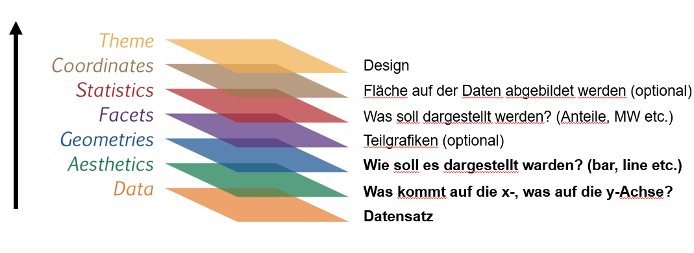

## Willkommen zurück!

:::::: columns
::: {.column width="70%"}

:::

:::: {.column width="30%"}
::: {.fragment style="font-size: 0.75em;"}
Spannende Fragen an Daten lassen sich meistens zwei Polen zuordnen:

1.  Variation einer Variable (Kennwerte, Sitzung 5 & Häufigkeiten, Sitzung 06)
2.  Kovariation zweier Variablen (Zusammenhänge, Sitzung 08)
:::
::::
::::::

## Variation untersuchen - 1 Variable {.smaller}

| Skalenniveau | Ziel / Frage | Kennwert / Tabelle | R-Funktion |
|----|----|----|----|
| Kategorial | Häufigkeiten | Häufigkeitstabelle | `dplyr::count()` · `count()` |
| Kategorial | Anteile | Relative Häufigkeiten | `dplyr::mutate(pct = n / sum(n) * 100)` |
| Metrisch | Zentrale Tendenz | Mittelwert · Median | `dplyr::summarise()` + `mean()` · `median()` |
| Metrisch | Streuung | SD · Varianz · IQR | `sd()` · `var()` · `IQR()` |
| Metrisch | Wertebereich | Min · Max | `min()` · `max()` |
| Metrisch | Überblick | Alle Kennwerte | `skimr::skim()` |

## Visualisierung - 1 Variable {.smaller}

| Skalenniveau | Ziel / Frage          | Visualisierung | ggplot2            |
|--------------|-----------------------|----------------|--------------------|
| Kategorial   | Häufigkeit/Verteilung | Balkendiagramm | `geom_bar()`       |
| Metrisch     | Verteilung            | Histogramm     | `geom_histogram()` |
| Metrisch     | Streuung / Ausreißer  | Boxplot        | `geom_boxplot()`   |

## Grammar of Graphics {.smaller}



Für detaillierte Einblicke empfehle ich das {EBook}(https://ggplot2-book.org/) von Hadley Wickham!

## Grammar of Graphics

``` r
ggplot(data = mein_datensatz,       # Data
       aes(x = variable_a,          # Aesthetics
           y = variable_b)) +
  geom_point() +                    # Geometries
  facet_wrap(~ gruppe) +            # Facets
  theme_minimal()                   # Theme
```

## Geometries {.smaller data-fragments="false"}

::::: columns
::: {.column width="50%"}
**Balken & Häufigkeiten**

-   `geom_bar()` — Häufigkeiten (nur x nötig)
-   `geom_col()` — Werte aus Daten (x und y nötig)
-   `geom_histogram()` — Verteilung numerischer Var.

**Linien & Punkte**

-   `geom_point()` — Streudiagramm
-   `geom_line()` — Zeitverlauf
:::

::: {.column width="50%"}
**Verteilungen**

-   `geom_boxplot()` — Boxplot
-   `geom_violin()` — Violinplot
-   `geom_density()` — Dichtekurve

**Zusammenfassungen**

-   `geom_smooth()` — Trendlinie (`lm`, `loess`)
-   `geom_errorbar()` — Fehlerbalken
-   `geom_text()` / `geom_label()` — Beschriftungen
:::
:::::

## Themes im Vergleich

```{r}
#| echo: false
#| fig-width: 10
#| fig-height: 5
library(ggplot2)
library(patchwork)

df <- data.frame(
  x = c("A", "B", "C", "D"),
  y = c(3.2, 5.1, 4.4, 6.8)
)

p <- ggplot(df, aes(x = x, y = y, fill = x)) +
  geom_col(show.legend = FALSE) +
  labs(x = NULL, y = NULL)

p1 <- p + theme_grey()     + labs(title = "theme_grey()")
p2 <- p + theme_classic()  + labs(title = "theme_classic()")
p3 <- p + theme_minimal()  + labs(title = "theme_minimal()")
p4 <- p + theme_light()    + labs(title = "theme_light()")
p5 <- p + theme_bw()       + labs(title = "theme_bw()")
p6 <- p + theme_linedraw() + labs(title = "theme_linedraw()")

(p1 + p2 + p3) / (p4 + p5 + p6)
```

## Farben in ggplot2 {.smaller}

::::: columns
::: {.column width="50%"}
**Farben benennen oder als Hex-Code**

``` r
# Farbnamen
geom_col(fill = "steelblue")
geom_col(fill = "lightgray")

# Hex-Code
geom_col(fill = "#FF0000")   # rot
geom_col(fill = "#D3D3D3")   # hellgrau
```

**Eigener Farbvektor** (z.B. für Parteien)

``` r
party_colors <- c(
  "SPD" = "#E3000F",
  "CDU" = "#000000",
  "Grüne" = "#1AA037",
  "FDP" = "#FFED00",
  "AfD" = "#009EE0"
)

ggplot(...) +
  scale_fill_manual(values = party_colors)
```
:::

::: {.column width="50%"}
**Eine Fülle an Farbpaletten mit `paletteer`**

```{r}
#| echo: false
#| fig-height: 2.5
library(ggplot2)
library(paletteer)
library(dplyr)

data.frame(x = LETTERS[1:6], y = c(4, 7, 3, 6, 5, 8)) %>%
  ggplot(aes(x = x, y = y, fill = x)) +
  geom_col(show.legend = FALSE) +
  scale_fill_paletteer_d("RColorBrewer::Set1") +
  theme_minimal() +
  labs(x = NULL, y = NULL,
       title = "RColorBrewer::Set1")
```

Mehr Paletten unter: [r-graph-gallery.com](https://r-graph-gallery.com/ggplot2-color.html)
:::
:::::

## Farben in ggplot2 {.smaller}

**Farbnamen & Hex-Codes**

``` r
# Farbnamen direkt verwenden
geom_col(fill = "steelblue")
geom_col(fill = "lightgray")

# Hex-Code
geom_col(fill = "#FF0000")   # rot
geom_col(fill = "#D3D3D3")   # hellgrau
```

Eine Übersicht aller R-Farbnamen: `colors()`

------------------------------------------------------------------------

## Farben in ggplot2 {.smaller}

**Selbst definierter Farbvektor**

``` r
party_colors <- c(
  "SPD"   = "#E3000F",
  "CDU"   = "#000000",
  "Grüne" = "#1AA037",
  "FDP"   = "#FFED00",
  "AfD"   = "#009EE0"
)

ggplot(...) +
  scale_fill_manual(values = party_colors)
```

------------------------------------------------------------------------

## Farben in ggplot2 {.smaller}

**Farbpaletten mit `paletteer`**

```{r}
#| echo: false
#| fig-height: 2.5
library(ggplot2)
library(paletteer)
library(dplyr)

data.frame(x = LETTERS[1:6], y = c(4, 7, 3, 6, 5, 8)) %>%
  ggplot(aes(x = x, y = y, fill = x)) +
  geom_col(show.legend = FALSE) +
  scale_fill_paletteer_d("RColorBrewer::Set1") +
  theme_minimal() +
  labs(x = NULL, y = NULL, title = "RColorBrewer::Set1")
```

Mehr Paletten unter: [r-graph-gallery.com](https://r-graph-gallery.com/ggplot2-color.html)

## Und, denkt immer daran... {.smaller}

::: {style="margin-top: 2em;"}
> „Eine gute Grafik ist fertig, wenn sie die Botschaft klar vermittelt. Eine perfekte Grafik ist nie fertig."
>
> — paraphrasiert nach Hadley Wickham
:::

::: {style="margin-top: 1.5em;"}
> „Spend 80% of your time getting the first 80% of the graphic right — don't waste too much time chasing the last 20% of perfection."
>
> — frei nach gängigen Empfehlungen in DataViz-Communities
:::

::: {style="margin-top: 1.5em;"}
> „It takes a few minutes to make a good plot, and hours (or days) to make a perfect one."
>
> — anonyme DataViz-Folklore
:::

# AB HIER NOCH ERNEUERN

# Recap

1.  Kennwerte in R berechnen
2.  Boxplots
3.  Code, Output und Interpretation mit Quarto in einem Dokument (z.B. PDF) zusammenbringen

::: callout-tip
## Kennwerte

-   Lagemaße: Modus; Mittelwert (arithmetisches Mittel); Median; ...

-   Streuungsmaße: Spannweite (range); Quartile, Interquartilsabstand (IQR); Varianz, bzw. Standardabweichung; ...
:::

## Boxplots

```{r}
#| label: boxplot-alter
#| echo: false
#| fig-width: 10
#| fig-height: 4.5
#| out-width: "100%"

library(tidyverse)
library(patchwork)

set.seed(42)
n <- 40

col_box      <- "#378ADD"
col_box_fill <- "#E6F1FB"
col_med      <- "#185FA5"
col_mean     <- "#D85A30"
col_pts      <- "#888780"

dat <- dplyr::bind_rows(
  tibble(gruppe = "Symmetrisch",  alter = round(rnorm(n, mean = 24, sd = 2.5))),
  tibble(gruppe = "Rechtsschief", alter = round(c(rnorm(n * 0.85, mean = 22, sd = 1.2), runif(n * 0.15, min = 29, max = 38)))),
  tibble(gruppe = "Linksschief",  alter = round(c(rnorm(n * 0.85, mean = 28, sd = 1.5), runif(n * 0.15, min = 18, max = 21)))),
  tibble(gruppe = "Bimodal",      alter = round(c(rnorm(n / 2, mean = 21, sd = 1.2), rnorm(n / 2, mean = 27, sd = 1.2))))
) %>%
  dplyr::mutate(gruppe = factor(gruppe,
    levels = c("Symmetrisch", "Rechtsschief", "Linksschief", "Bimodal")))

theme_slide <- function() {
  theme_minimal(base_size = 11) +
    theme(
      panel.grid.major.x = element_blank(),
      panel.grid.minor   = element_blank(),
      panel.grid.major.y = element_line(color = "#D3D1C7", linewidth = 0.4),
      axis.title.x       = element_blank(),
      axis.text.x        = element_blank(),
      axis.ticks.x       = element_blank(),
      axis.title.y       = element_text(color = "#5F5E5A", size = 9),
      axis.text.y        = element_text(color = "#5F5E5A", size = 9),
      plot.title         = element_text(size = 11, face = "bold", color = "#2C2C2A"),
      plot.subtitle      = element_text(size = 8.5, color = "#5F5E5A"),
      plot.margin        = margin(8, 8, 4, 8)
    )
}

make_panel <- function(data, titel, subtitle = "") {
  med <- median(data$alter)
  mw  <- mean(data$alter)
  ggplot(data, aes(x = 0, y = alter)) +
    geom_jitter(width = 0.18, alpha = 0.55, size = 1.8, color = col_pts) +
    geom_boxplot(
      width = 0.35, outlier.shape = 1,
      outlier.color = "#A32D2D", outlier.size = 2.5,
      fill = col_box_fill, color = col_box,
      linewidth = 0.6, coef = 1.5, fatten = NULL
    ) +
    geom_segment(aes(x = -0.175, xend = 0.175, y = med, yend = med),
      color = col_med, linewidth = 1.4) +
    geom_point(aes(x = 0, y = mw),
      shape = 23, size = 3, fill = col_mean, color = col_mean) +
    scale_x_continuous(limits = c(-0.5, 0.5)) +
    scale_y_continuous(limits = c(17, 40), breaks = seq(18, 40, by = 4)) +
    labs(title = titel, subtitle = subtitle, y = "Alter (Jahre)") +
    theme_slide()
}

p1 <- make_panel(dplyr::filter(dat, gruppe == "Symmetrisch"),  "Symmetrisch",  "Median ≈ Mittelwert")
p2 <- make_panel(dplyr::filter(dat, gruppe == "Rechtsschief"), "Rechtsschief", "Mittelwert > Median")
p3 <- make_panel(dplyr::filter(dat, gruppe == "Linksschief"),  "Linksschief",  "Mittelwert < Median")
p4 <- make_panel(dplyr::filter(dat, gruppe == "Bimodal"),      "Bimodal",      "Box verdeckt Zweigipfligkeit")

(p1 | p2 | p3 | p4) +
  plot_annotation(
    caption = "— Median  |  ◆ Mittelwert  |  Kasten = IQR (mittlere 50 %)  |  Whisker = 1.5 × IQR  |  ○ Ausreißer  |  Punkte = Einzelbeobachtungen",
    theme = theme(plot.caption = element_text(size = 7.5, color = "#5F5E5A", hjust = 0))
  )
```

# Was heute ansteht:

-   Check-In: Fragen zu Quarto, Kennwerten etc.
-   Besprechung der Übung 4
-   Häufigkeiten und Visualisierung

#  Feedback zu Übung 4

-   dar steht für daraus/darunter (also "Sonstige Parteien", "daraus BSW")
-   `filter()` und `select()` tun sehr unterschiedliche Dinge
-   `filter()`-Aufgabe kann unterschiedlich gelöst werden: `wahlkreis_nr > 900` oder `wahlkreis_name == "Land Insgesamt" | wahlkreis_name == "Insgesamt"` oder `dplyr::filter(wknr %in% c(901, 902, 903 ... ))`
-   in `case_when()` wurde `TRUE ~` durch `.default ~` ersetzt

## kategoriale und kontinuierliche Variablen

-   die meisten Kennwerte ergeben nur für metrische Variablen Sinn
-   diese können wir aber dann nach kategorialen Variaben gruppiert ausgeben
-   z.B. Mittelwert der Körpergröße nach Geschlecht, Mittleres Einkommen nach Bildungsabschluss etc.
-   bei kategorialen Variablen können Häufigkeiten gezählt werden

# Hands On - Häufigkeitszäglungen


## Minute Cards

Bitte füllt die Minute Cards für die heutige Sitzung aus. Das sollt enicht länger als 3 Minuten dauern. Vielen Dank für eure Mitarbeit!

```{r}
#| echo: false
library(qrcode)
qr <- qrcode::qr_code("https://forms.gle/xScN9nh3n2yjZXXK8")
plot(qr)
```

# Vielen Dank und bis kommenden Dienstag!

::: {style="margin-top: 1em;"}

:::

::: {style="display: flex; align-items: center; gap: 1em; "}
{style="width: 140px;"}

**Übung 4** zu "Daten Aggregieren" bis spätestens Sonntagabend!
:::

------------------------------------------------------------------------
