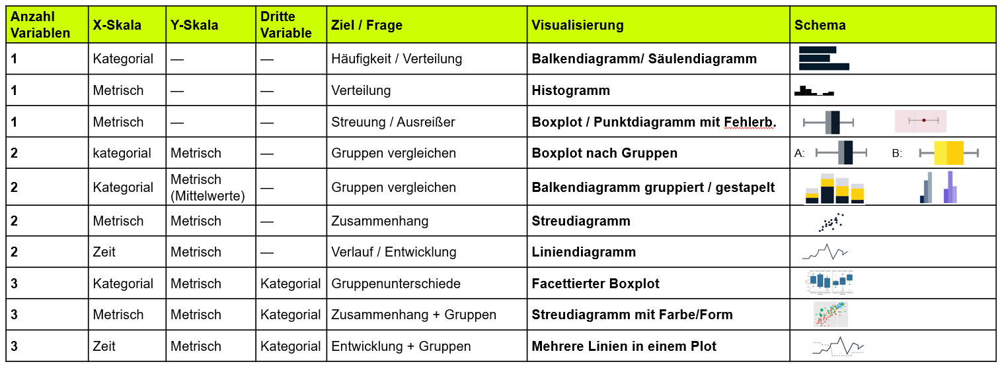
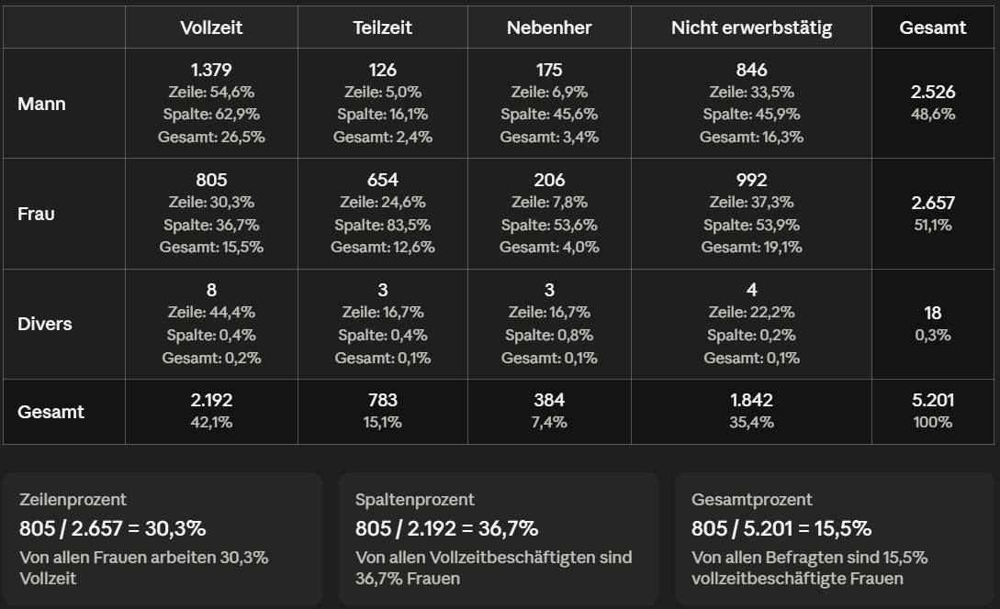
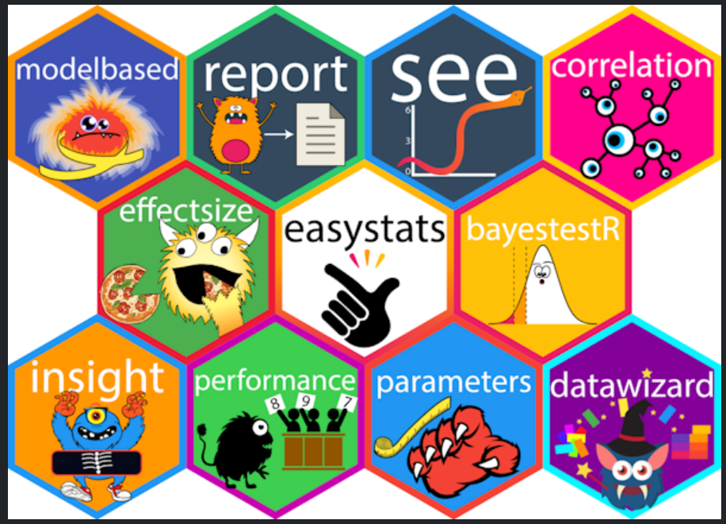

## Willkommen zurück!

:::::: columns
::: {.column width="70%"}

:::

:::: {.column width="30%"}
::: {.fragment style="font-size: 0.75em;"}
Spannende Fragen an Daten lassen sich meistens zwei Polen zuordnen:

1.  Variation einer Variable (Kennwerte, Sitzung 5 & Häufigkeiten, Sitzung 06)
2.  Kovariation zweier Variablen (Zusammenhänge, Sitzung 08)
:::
::::
::::::

## Recap: Visualisierungen



## Variation untersuchen - 1 Variable {.smaller}

| Skalenniveau | Ziel / Frage | Kennwert / Tabelle | R-Funktion | Visualisierung | R-Funktion |
|------------|------------|------------|------------|------------|------------|
| Kategorial | Häufigkeiten | Häufigkeitstabelle | `dplyr::count()` | Balkendiagramm | `barplot()` |
| Kategorial | Anteile | Relative Häufigkeiten | `mutate(pct = n/sum(n)*100)` | Balkendiagramm | `barplot()` |
| Metrisch | Verteilung | Klassierte Häufigkeiten | `cut()` + `count()` | Histogramm | `hist()` |
| Metrisch | Zentrale Tendenz | Mittelwert · Median | `mean()` · `median()` | Boxplot | `boxplot()` |
| Metrisch | Streuung | SD · Varianz · IQR | `sd()` · `var()` · `IQR()` | Boxplot | `boxplot()` |
| Metrisch | Wertebereich | Min · Max | `min()` · `max()` | Boxplot | `boxplot()` |
| Metrisch | Überblick | Alle Kennwerte | `skimr::skim()` | — | — |

::: callout-tip
Das haben wir in Sitzungen 5 und 6 und 7 gelernt!
:::

## Variation untersuchen - 2 Variablen {.smaller}

| Skalenniveau | Ziel / Frage | Kennwert / Tabelle | R-Funktion |
|------------------|------------------|------------------|------------------|
| Kat. × Kat. | Gemeinsame Häufigk. | Kreuztabelle | `count() + janitor; gtsummary::tbl_cross(); questionr::wtd.table()` |
| Kat. × Metrisch | Gruppen vergleichen | Kennwerte nach Gruppe | `group_by() %>% summarise()` |
| Metrisch × Metrisch | Zusammenhang | Korrelationskoeffizient | `correlation::correlation()` |

::: callout-tip
Wie wir Zusammenhänge zwischen zwei Variablen (bzw. Kovariation) untersuchen und visualisieren können, lernen wir heute!
:::

## Visualisierung - 2 Variablen {.smaller}

| Skalenniveau | Ziel / Frage | Visualisierung | ggplot2 |
|------------------|------------------|------------------|------------------|
| Kat. × Metrisch | Gruppen vergleichen | Boxplot / Balkendiagramm n. Gr. | `geom_boxplot()` · `geom_col()` |
| Metrisch × Metrisch | Zusammenhang | Streudiagramm | `geom_point()` |
| Zeit × Metrisch | Verlauf | Liniendiagramm | `geom_line()` |

## Mid-term Feedback {.smaller}

::::: columns
::: column
**Was euch gefällt/ hilft:**

-   Seminaratmosphäre
-   Übungen
-   Wiederholung & individuelle Fragen
-   Erreichbarkeit & Support
-   Cheatsheets, Skripte, Webseite, Material
:::

::: column
**Verbesserungswünsche**:

-   weniger Recap & individuelle Problemlösung

-   Zeitaufteilung: Wdh. vs. Neues

-   Data Access und Codebook thematisieren

-   Datenbereinigung intensiver behandeln

-   Übung & Sitzungsnummern harmonisieren, MacUser-Besonderheiten behandeln, Befehlsammlung erstellen
:::
:::::

# Zusammenhänge

## Kreuztabelle {.smaller}

-   Zusammenhänge können mit Kreuztabellen oder Korrelationsmaßen dargestellt werden

::: fragment
{style="width: 800px;"}
:::

## Korrelationsmaße {.smaller}

-   Zusammenhänge können mit Kreuztabellen oder Korrelationsmaßen dargestellt werden

-   Korrelationsmaße (auch Zusammenhangsmaße) geben Auskunft darüber, inwiefern ein Zusammenhang zwischen Variablen besteht.

-   Wertebereich -1 (perfekt negativer Zusammenhang) bis +1 (perfekt positiver Zusammenhang)

    -   Ab (+/-) r=.10 spricht man von einem schwachen Zusammenhang (schwacher Effekt)

    -   Ab (+/-) r=.30 spricht man von einem mittleren Zusammenhang (mittlerer Effekt)

    -   Ab (+/-) r=.50 spricht man von einem starken Zusammenhang (starker Effekt).

-   mehr dazu, wie er konkret berechnet wird unter [Statistik-Grundlagen](https://statistikgrundlagen.de/ebook/part/zusammenhaenge-und-standardisierung/)

## Korrelationsmaße

```{r}
#| echo: false
library(dplyr)
library(kableExtra)

tibble::tribble(
  ~` `,          ~metrisch,       ~ordinal,                                  ~nominal,
  "metrisch",    "Pearson's r",   "Spearman's ρ (rho) / Kendall's τ (tau)", "Pearson's r (dichotom) / Eta η (eta) (polytom)",
  "ordinal",     "",              "Spearman's ρ (rho) / Kendall's τ (tau)", "Spearman's ρ (rho) (dichotom)",
  "nominal",     "",              "",                                        "Phi φ (phi) (dichotom) / Cramér's V (polytom)"
) %>%
  knitr::kable(escape = FALSE) %>%
  kableExtra::kable_styling(full_width = TRUE) %>%
  kableExtra::column_spec(1, bold = TRUE, border_right = "1px solid black") %>%
  kableExtra::column_spec(2, border_right = "1px solid black") %>%
  kableExtra::column_spec(3, border_right = "1px solid black") %>%
  kableExtra::row_spec(0, extra_css = "border-bottom: 1px solid black;") %>%
  kableExtra::row_spec(1:3, extra_css = "border-bottom: 1px solid black;")

```


-   mehr zu den verschiedenen Korrelationsmaßen unter [Statistik-Grundlagen](https://statistikgrundlagen.de/ebook/chapter/korrelation/) in Kapitel 4 zu Korrelationen!


## Grenzen der Korrelationsmaße

-   Misst nur lineare Zusammenhänge!

-   Aber, wie wir wissen gibt es auch andere Zusammenhänge

-   Bsp.: Partyhäufigkeit und Alter; Quadratische Korrelationen

-   Korrelation ist keine Kausalität!

-   Bsp.: Menschen mit Feuerzeug haben ein erhöhtes Lungenkrebsrisiko

# *correlation*-Paket

:::::: columns
:::: column
::: fragment
{style="width: 400px;"}
:::
::::

::: column
-   Teil von *easystats*
-   "An R Framework for Easy Statistical Modeling, Visualization, and Reporting"
-   Mehr auf der [Github-Seite](https://easystats.github.io/easystats/)
:::
::::::

# Hands On - Zusammenhänge


## Minute Cards

Bitte füllt die Minute Cards für die heutige Sitzung aus. Das sollt enicht länger als 3 Minuten dauern. Vielen Dank für eure Mitarbeit!

```{r}
#| echo: false
library(qrcode)
qr <- qrcode::qr_code("https://forms.gle/xScN9nh3n2yjZXXK8")
plot(qr)
```

# Vielen Dank und bis kommenden Dienstag!

::: {style="margin-top: 1em;"}

:::

::: {style="display: flex; align-items: center; gap: 1em; "}
{style="width: 140px;"}

**Übung 7** zu Zusammenhängen bis spätestens Sonntagabend!
:::
