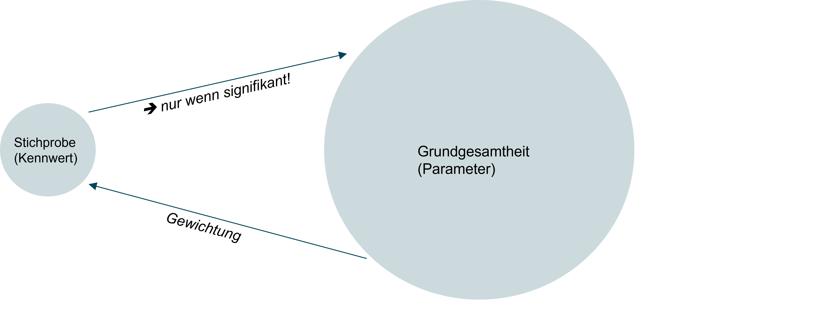
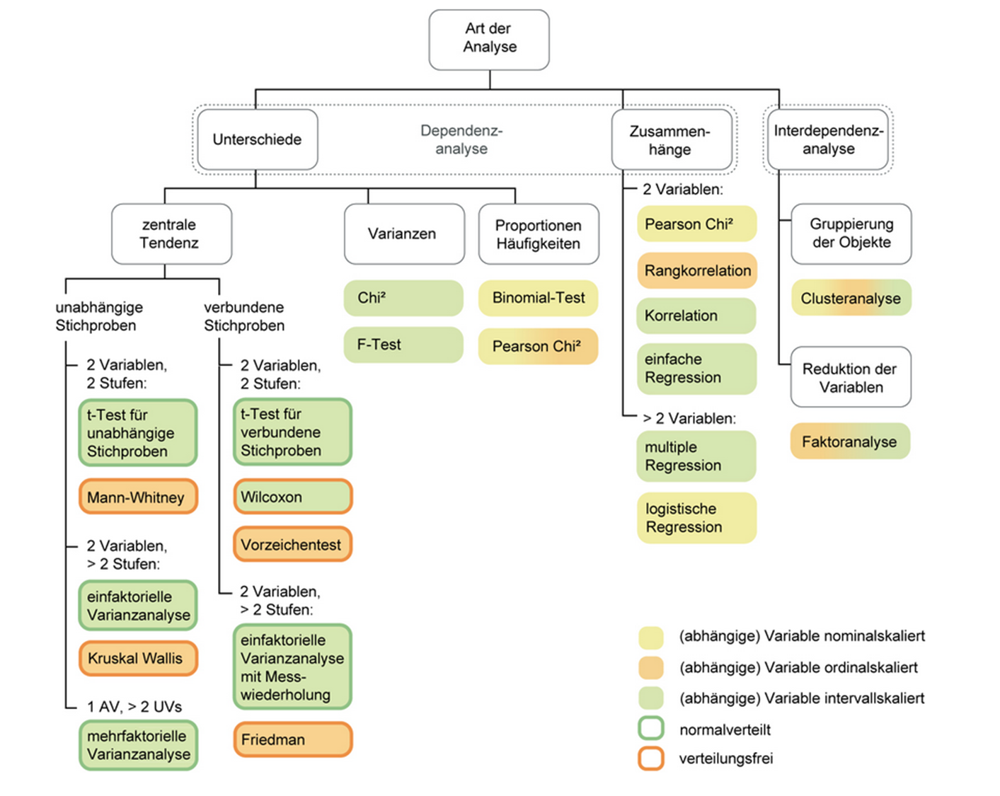
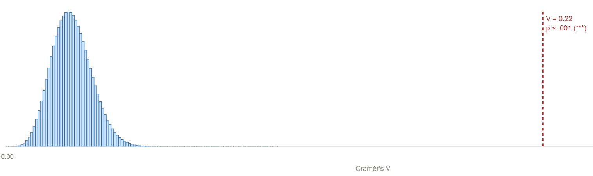
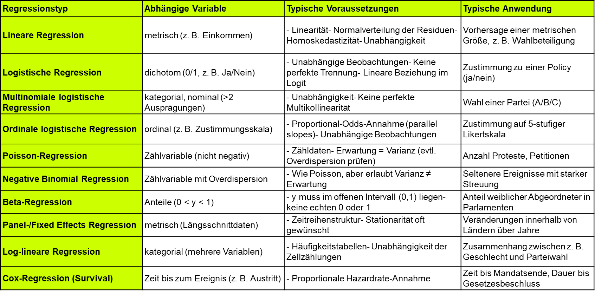
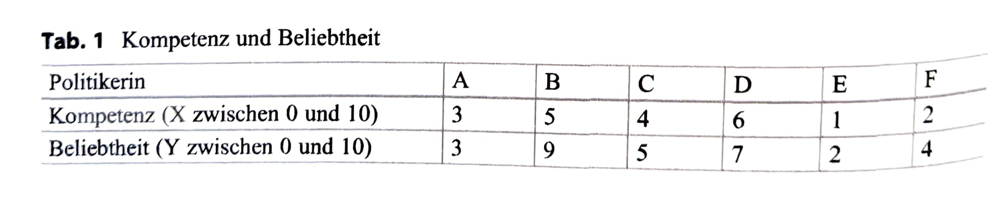
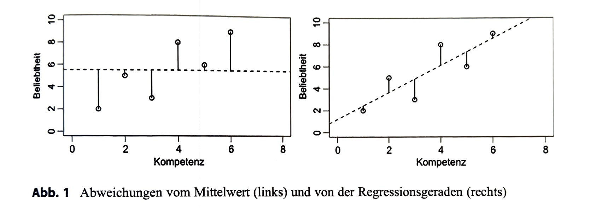
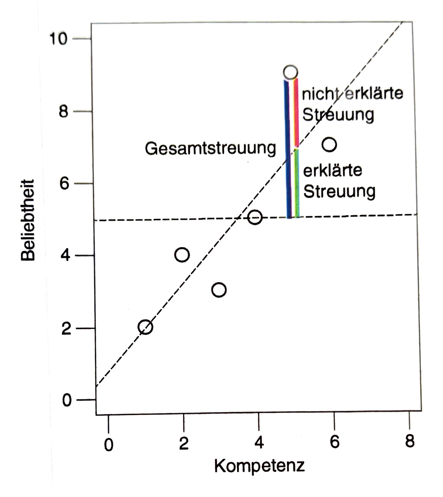

## Willkommen zurück!


## Recap: Korrelationen {.smaller}

-   Zusammenhänge können mit Kreuztabellen oder Korrelationsmaßen dargestellt werden

-   Korrelationsmaße (auch Zusammenhangsmaße) geben Auskunft darüber, inwiefern ein Zusammenhang zwischen Variablen besteht.

-   Wertebereich -1 (perfekt negativer Zusammenhang) bis +1 (perfekt positiver Zusammenhang)

    -   Ab (+/-) r=.10 spricht man von einem schwachen Zusammenhang (schwacher Effekt)

    -   Ab (+/-) r=.30 spricht man von einem mittleren Zusammenhang (mittlerer Effekt)

    -   Ab (+/-) r=.50 spricht man von einem starken Zusammenhang (starker Effekt).

-   mehr dazu, wie er konkret berechnet wird unter [Statistik-Grundlagen](https://statistikgrundlagen.de/ebook/part/zusammenhaenge-und-standardisierung/)

## Korrelationsmaße

```{r}
#| echo: false
library(dplyr)
library(kableExtra)

tibble::tribble(
  ~` `,          ~metrisch,       ~ordinal,                                  ~nominal,
  "metrisch",    "Pearson's r",   "Spearman's ρ (rho) / Kendall's τ (tau)", "Pearson's r (dichotom) / Eta η (eta) (polytom)",
  "ordinal",     "",              "Spearman's ρ (rho) / Kendall's τ (tau)", "Spearman's ρ (rho) (dichotom)",
  "nominal",     "",              "",                                        "Phi φ (phi) (dichotom) / Cramér's V (polytom)"
) %>%
  knitr::kable(escape = FALSE) %>%
  kableExtra::kable_styling(full_width = TRUE) %>%
  kableExtra::column_spec(1, bold = TRUE, border_right = "1px solid black") %>%
  kableExtra::column_spec(2, border_right = "1px solid black") %>%
  kableExtra::column_spec(3, border_right = "1px solid black") %>%
  kableExtra::row_spec(0, extra_css = "border-bottom: 1px solid black;") %>%
  kableExtra::row_spec(1:3, extra_css = "border-bottom: 1px solid black;")

```

-   mehr zu den verschiedenen Korrelationsmaßen unter [Statistik-Grundlagen](https://statistikgrundlagen.de/ebook/chapter/korrelation/) in Kapitel 4 zu Korrelationen!

# Was heute ansteht

1.  Organisatorisches (Übungsfeedback, Fragen etc.)

2.  Einführung in die Grundidee der Inferenzstatistik

3.  Regressionen

# Inferenzstatistik

## Korrelationsmaße - Beispiel {.smaller}

Beispiel: Zusammenhang zwischen Geschlecht und Erwerbsstatus

-   Kreuztabellen haben uns gezeigt, dass *in unserere Stichprobe* Männer häufiger Vollzeit arbeiten als Frauen (circa 50% d. Männer vs. 30% d.Frauen)

-   Das dazugehörige Korrelationsmaß zwischen Geschlecht und Erwerbsstatus (Cramers V) betrug 0.22 =\> nach Cohens Konvention also ein mittelstarker Zusammenhang

-   Aber gibt es den gefundenen Zusammenhang am Ende nur in der Stichprobe, nicht in Wirklichkeit?! Oder ist er in Wirklichkeit anders (z.B. größer) als in der Stichprobe?!

-   zum Beispiel, weil der Osten überrepräsentiert ist, und dort Frauen mehr arbeiten (hot take)

-   oder, weil mehr hochgebildete Menschen an Umfragen teilnehmen und in dieser Gesellschaftsschicht mehr Frauen arbeiten (hot take)

## Inferenzstatistik



## ... ist ein riesiges Feld



Quelle: Methodenberatung Uni Zürich

## Inferenz durch Parameterschätzung

-   Grundsätzlich gibt es also neben der Effektstärke (z.B. Korrelationsmaß), die uns sagt, ob der Effekt *relevant* ist ...

-   auch noch die Frage, ob richtig geschätzt wurde und der gefundene Effekt also *signifikant* ist!

-   Für Letzteres gibt es zwei grundsätzliche Herangehensweisen: Punkt - und Intervallschätzung

-   Punktschätzung: p-Wert, Signifikanzniveau & \*\*\*

-   Intervallschätzung: Konfidenzintervalle

::: {.callout-tip .fragment}
## Inferenz verstehen

-   Kapitel 8 (Parameterschätzung), und 9 (Intervallschätzung) in [Statistik Grundlagen](https://statistikgrundlagen.de/ebook/chapter/stichproben/)

-   bei Bedarf ggf. noch Kapitel 7 zu Stichproben als Grundlage
:::

## Punktschätzung - Beispiel

**H~1~:** Es gibt einen Zusammenhang zwischen Geschlecht und Erwerbsstatus (V \> 0)\
**H~0~:** Es gibt keinen Zusammenhang (V = 0)

In der Stichprobe gefunden:

-   Etwa 50% der Männer arbeiten Vollzeit und nur 30% der Frauen. Korrelationskoeffizient (Cramers V) zwischen Geschlecht und Erwerbsstatus von 0,22 (mittelstark)

-   Nun wollen wir wissen, wie gut unser Punktschätzer, also das Cramérs V von 0,22, den wahren Parameter in der GG schätzt

## Punktschätzung - Beispiel



## Punktschätzung - Beispiel

-   Um die Signifikanz zu bestimmen, wird die Verteilung aller V-Werte modelliert, die wir in unendlich vielen Stichproben beobachten würden, **wenn H₀ stimmte**.

-   Diese Stichprobenkennwerteverteilung von V unter H0 ist mathematisch hergeleitet

-   **Der p-Wert ist der Anteil dieser hypothetischen Stichproben, die einen genauso extremen oder noch extremeren Wert geliefert hätten wie unsere Schätzung**\
    → Ist dieser Anteil klein (≤ 5 %), verwerfen wir H₀ und der Effekt gilt als **statistisch signifikant** (`*` p \< .05, `**` p \< .01, `***` p \< .001)

## Intervallschätzung

**Punktschätzung:** In unserer Stichprobe beträgt V = 0.22 — das ist unsere beste Schätzung für die Grundgesamtheit.\
**Intervallschätzung:** Würden wir das Verfahren 100× wiederholen, würde das KI in 95 von 100 Fällen den wahren Wert enthalten.

→ Der wahre Zusammenhang in der Grundgesamtheit liegt wahrscheinlich zwischen V = 0.20 und V = 0.24.

# Regressionen

-   Was sind Regressionen?
-   Einfache lineare & multiple lineare Regression
-   Voraussetzungen & Verletzungen (nächste Woche!)
-   Logistische Regression (übernächste Woche!)
-   Anwendung in R

# Was sind Regressionen?

-   Regressionen sind **stochastische** Vorhersagen (≠ deterministisch)

-   Regression kann **deskriptiv** und **schließend** eingesetzt werden

-   beantworten Fragen wie: Kann man y basierend auf x vorhersagen? Kann man y auf x zurückführen?

-   Vom Lateinischen regredi = „zurückgehen“


## Die Welt der Regressionen



## Die einfache lineare Regression

-   Eine (einfache) lineare Regression zu rechenen heißt eine Gerade durch Punkte zu ziehen!

-   AV $\leftarrow$ UV

-   Regressionskoeffizient $b$: Wenn x um eine Einheit steigt, ändert sich y um den Betrag $b$.


## Begriffsverwirrung:

```{r}
#| echo: false 

library(dplyr) 
library(kableExtra)  

tibble::tribble(   ~X,                          ~Y,   "Prädiktor",                 "Kriterium",   "Unabhängige Variable (UV)", "Abhängige Variable (AV)",   "Regressor",                 "Regressand",   "Erklärende Variable",       "Erklärte Variable",   "Einflussgröße",             "Response" ) %>%   knitr::kable(escape = FALSE) %>%   kableExtra::kable_styling(full_width = TRUE) %>%   kableExtra::column_spec(1, border_right = "1px solid black") %>%   kableExtra::row_spec(0, bold = TRUE, extra_css = "border-bottom: 2px solid black;") %>%   kableExtra::row_spec(1:5, extra_css = "border-bottom: 1px solid black;")
```

## Beispiel: Einfache lineare Regression





## Methode der kleinsten Quadrate

-   Abweichungen von der Geraden = **Residuen**

-   **Kleinste-Quadrate-Schätzung** (*ordinary least squares*, OLS)

-   Alle Residuen werden **quadriert** und aufsummiert (damit sich $-$ und $+$ nicht aufheben)

-   R findet die Gerade, bei der die **Summe der quadrierten Residuen minimal** ist

## Modellgüte

::::: columns
::: {.column width="60%"}
-   Bestimmtheitsmaß R² = Anteil der aufgeklärten Varianz
-   Welcher Anteil der Streuung von Y wird durch das Regressionsmodell erklärt?
-   $R^2 = \frac{\text{erklärte Streuung}}{\text{gesamte Streuung}}$
-   $\uparrow$ Residuen $\Rightarrow$ $\downarrow$ Modellgüte
-   $\downarrow$ Residuen $\Rightarrow$ $\uparrow$ Modellgüte
-   Korrigiertes R²: korrigiert um die Anzahl der UVen bei multipler linearer Regression
-   Mögliche Alternative: F-Test
:::

::: {.column width="40%"}

:::
:::::

## Signifikanz und KI

-   gleiches Prinzip wie bei anderen Kennwerten
-   H$_0$ = kein Zusammenhang (Regressionskoeffizient $b$ = 0)
-   Stichprobenverteilung von $b$ unter H$_0$ (t-Verteilung)
-   Standardfehler (Standardabweichung der Stichprobenverteilung): Wie stark würde $b$ in verschiedenen Stichproben schwanken, wenn H0 stimmte?

## Signifikanz und KI

-   p-Wert:
    -   Wie wahrscheinlich ist es, einen solchen oder noch extremeren Koeffizienten zu beobachten, wenn H$_0$ (= kein Zusammenhang) stimmte?
    -   Beispielschwellwerte: p \< 0.001 = hochsignifikant \*\*\*, p \< 0.01 = signifikant \*\*, p \< 0.05 = schwach signifikant \*, p \> 0.05 = nicht signifikant
-   KI:
    -   95% KI enthält 0 $\Rightarrow$ nicht signifikant; 95% KI enthält keinen Wert über 0 $\Rightarrow$ signifikant
    -   In 95 von 100 Stichproben würde das berechnete Konfidenzintervall den wahren Regressionskoeffizienten in der Grundgesamtheit enthalten.
    -   Wenn man den Zorn der Statistiker\*innen auf sich zeihen will: Der wahre Regressionskoeffizient liegt mit 95%iger Wahrscheinlichkeit im KI.

## Die multiple lineare Regression


## Die multiple lineare Regression

$$\hat{y} = b_0 + b_1 x_1 + b_2 x_2 + \ldots + b_k x_k$$

-   Die $b$-Koeffizienten geben den **spezifischen / isolierten Einfluss** jedes Prädiktors an:

-   Wenn $x_k$ um eine Einheit steigt, ändert sich $y$ um $b_k$,**wenn alle anderen Prädiktoren konstant bleiben** (*ceteris paribus*).

::: {.callout-tip .fragment}
## Multiple ≠ Multivariate Regression

Multiple = mehrere **unabhängige** Variablen\
Multivariate = mehrere **abhängige** Variablen
:::

## Ziele der multiplen linearen Regression

-   **Varianzaufklärung**: Möglichst gut vorhersagen — z.B. wie viele Punkte werden erreicht?

-   **Prinzip der Parsimonität**: Mit **möglichst wenig Prädiktoren** möglichst viel Streuung erklären

## Anwendung in R

```{r}
#| echo: true
#| eval: false

# Einfache lineare Regression
modell_1 <- lm(av ~ uv, data = datensatz)
summary(modell_1)

# Multiple lineare Regression
modell_2 <- lm(av ~ uv1 + uv2 + uv3, data = datensatz)
summary(modell_2)
```

::: {style="margin-top: 0.5em; font-size: 0.9em;"}
-   `lm()` für *linear model*
-   Formelschreibweise: `av ~ uv` (AV links, UV rechts)
-   `summary()` zeigt Koeffizienten, $R^2$, p-Werte
:::

# Hands On - Regressionen


## Minute Cards

Bitte füllt die Minute Cards für die heutige Sitzung aus. Das sollt enicht länger als 3 Minuten dauern. Vielen Dank für eure Mitarbeit!

```{r}
#| echo: false
library(qrcode)
qr <- qrcode::qr_code("https://forms.gle/xScN9nh3n2yjZXXK8")
plot(qr)
```

# Vielen Dank und bis kommenden Dienstag!

::: {style="margin-top: 1em;"}

:::

::: {style="display: flex; align-items: center; gap: 1em; "}
{style="width: 140px;"}

**Übung 8 zu Regressionen** bis spätestens Sonntagabend!
:::
