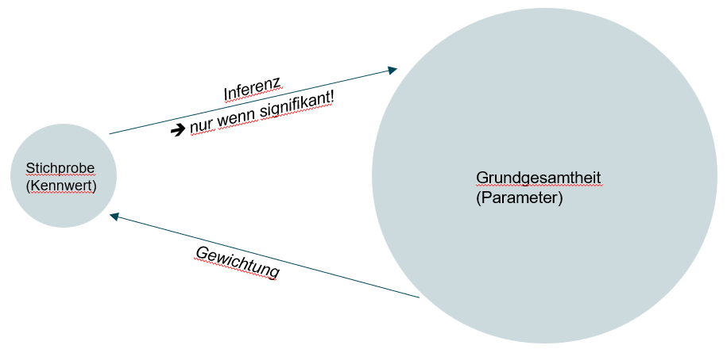

## Willkommen zurück!


## Recap: Korrelationen

-   Zusammenhänge können mit Kreuztabellen oder Korrelationsmaßen dargestellt werden

-   Korrelationsmaße (auch Zusammenhangsmaße) geben Auskunft darüber, inwiefern ein Zusammenhang zwischen Variablen besteht.

-   Wertebereich -1 (perfekt negativer Zusammenhang) bis +1 (perfekt positiver Zusammenhang)

    -   Ab (+/-) r=.10 spricht man von einem schwachen Zusammenhang (schwacher Effekt)

    -   Ab (+/-) r=.30 spricht man von einem mittleren Zusammenhang (mittlerer Effekt)

    -   Ab (+/-) r=.50 spricht man von einem starken Zusammenhang (starker Effekt).

-   mehr dazu, wie er konkret berechnet wird unter [Statistik-Grundlagen](https://statistikgrundlagen.de/ebook/part/zusammenhaenge-und-standardisierung/)

## Korrelationsmaße

```{r}
#| echo: false
library(dplyr)
library(kableExtra)

tibble::tribble(
  ~` `,          ~metrisch,       ~ordinal,                                  ~nominal,
  "metrisch",    "Pearson's r",   "Spearman's ρ (rho) / Kendall's τ (tau)", "Pearson's r (dichotom) / Eta η (eta) (polytom)",
  "ordinal",     "",              "Spearman's ρ (rho) / Kendall's τ (tau)", "Spearman's ρ (rho) (dichotom)",
  "nominal",     "",              "",                                        "Phi φ (phi) (dichotom) / Cramér's V (polytom)"
) %>%
  knitr::kable(escape = FALSE) %>%
  kableExtra::kable_styling(full_width = TRUE) %>%
  kableExtra::column_spec(1, bold = TRUE, border_right = "1px solid black") %>%
  kableExtra::column_spec(2, border_right = "1px solid black") %>%
  kableExtra::column_spec(3, border_right = "1px solid black") %>%
  kableExtra::row_spec(0, extra_css = "border-bottom: 1px solid black;") %>%
  kableExtra::row_spec(1:3, extra_css = "border-bottom: 1px solid black;")

```

-   mehr zu den verschiedenen Korrelationsmaßen unter [Statistik-Grundlagen](https://statistikgrundlagen.de/ebook/chapter/korrelation/) in Kapitel 4 zu Korrelationen!

# Was heute ansteht

1.  Organisatorisches (Übungsfeedback, Fragen etc.)

2.  Regressionen

3.  Einführung in die Grundidee der Inferenzstatistik

## Korrelationsmaße - Beispiel 

Beispiel: Zusammenhang zwischen Geschlecht und Erwerbsstatus

-   Kreuztabellen haben uns gezeigt, dass *in unserere Stichprobe* Männer häufiger Vollzeit arbeiten als Frauen (circa 50% d. Männer vs. 30% d.Frauen)

-   Das dazugehörige Korrelationsmaß zwischen Geschlecht und Erwerbsstatus (Cramers V) betrug 0.22 =\> nach Cohens Konvention also ein mittelstarker Zusammenhang

-   Aber gibt es den gefundenen Zusammenhang am Ende nur in der Stichprobe, nicht in Wirklichkeit?! Oder ist er in Wirklichkeit anders (z.B. größer) als in der Stichprobe?!

-   zum Beispiel, weil der Osten überrepräsentiert ist, und dort Frauen mehr arbeiten (hot take)

-   oder, weil mehr hochgebildete Menschen an Umfragen teilnehmen und in dieser Gesellschaftsschicht mehr Frauen arbeiten (hot take)

## Inferenzstatistik



## ... ist ein riesiges Feld 


Quelle: Methodenberatung Uni Zürich

## Inferenz durch Parameterschätzung

-   Grundsätzlich gibt es also neben der Effektstärke (z.B. Korrelationsmaß), die uns sagt, ob der Effekt *relevant* ist ...

-   auch noch die Frage, ob richtig geschätztwurde und der gefundene Effekt also *signifikant* ist!

-   Für Letzteres gibt es zwei grundsätzliche Herangehensweisen: Punkt - und Intervallschätzung

-   Punktschätzung: p-Wert, Signifikanzniveau & \*\*\*

-   Intervallschätzung: Konfidenzintervalle

## Punktschätzung 

-   Stichworte statistische Signifikanz, P-Wert und Sternchen

-   Ist ein Ergebnis (zum Beispiel ein gefundener Zusammenhang) *signifikant*?

-   Signifikant = überzufällig, also zu groß, um noch als zufällig zu gelten.

-   wie hoch die Wahrscheinlichkeit ist, dass ich etwas in meinen Daten finde, das in Wirklichkeit nicht da ist?

::: callout-tip
## Inferenz verstehen

-   Kapitel 8 (Parameterschätzung), und 9 (Intervallschätzung) in [Statistik Grundlagen](https://statistikgrundlagen.de/ebook/chapter/stichproben/)

-   bei Bedarf ggf. noch Kapitel 7 zu Stichproben als Grundlage
:::

## Punktschätzung - Beispiel 

**H~1~:** Es gibt einen Zusammenhang zwischen Geschlecht und Erwerbsstatus (V \> 0)\
**H~0~:** Es gibt keinen Zusammenhang (V = 0)

In der Stichprobe gefunden:

-   Etwa 50% der Männer arbeiten Vollzeit und nur 30% der Frauen. Korrelationskoeffizient (Cramers V) zwischen Geschlecht und Erwerbsstatus von 0,22 (mittelstark)

-   Nun wollen wir wissen, wie gut unser Punktschätzer, also das Cramérs V von 0,22, den wahren Parameter in der GG schätzt

## Punktschätzung - Beispiel 

-   Um die Signifikanz zu bestimmen, wird die Verteilung aller V-Werte modelliert, die wir in unendlich vielen Stichproben beobachten würden, **wenn H₀ stimmte**.

-   Diese Stichprobenkennwerteverteilung von V unter H0 ist mathematisch hergeleitet

-   **Der p-Wert ist der Anteil dieser hypothetischen Stichproben, die einen genauso extremen oder noch extremeren Wert geliefert hätten wie unsere.**\
    → Ist dieser Anteil klein (≤ 5 %), verwerfen wir H₀ und der Effekt gilt als **statistisch signifikant** (`*` p \< .05, `**` p \< .01, `***` p \< .001)


## Intervallschätzung 

**Punktschätzung:** In unserer Stichprobe beträgt V = 0.22 — das ist unsere beste Schätzung für die Grundgesamtheit.\
**Intervallschätzung:** Würden wir das Verfahren 100× wiederholen, würde das KI in 95 von 100 Fällen den wahren Wert enthalten.

→ Der wahre Zusammenhang in der Grundgesamtheit liegt wahrscheinlich zwischen V = 0.20 und V = 0.24.

# Hands On - Regressionen


## Minute Cards

Bitte füllt die Minute Cards für die heutige Sitzung aus. Das sollt enicht länger als 3 Minuten dauern. Vielen Dank für eure Mitarbeit!

```{r}
#| echo: false
library(qrcode)
qr <- qrcode::qr_code("https://forms.gle/xScN9nh3n2yjZXXK8")
plot(qr)
```

# Vielen Dank und bis kommenden Dienstag!

::: {style="margin-top: 1em;"}

:::

::: {style="display: flex; align-items: center; gap: 1em; "}
{style="width: 140px;"}

**Übung 7** zu Zusammenhängen bis spätestens Sonntagabend!
:::
