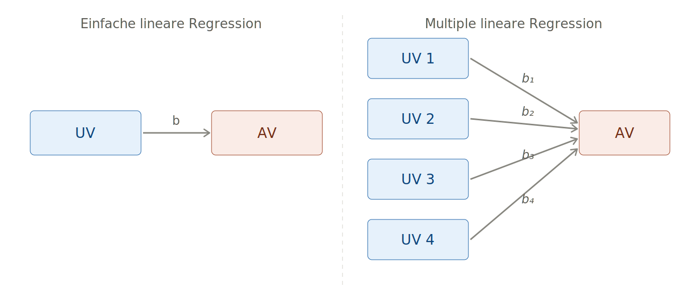
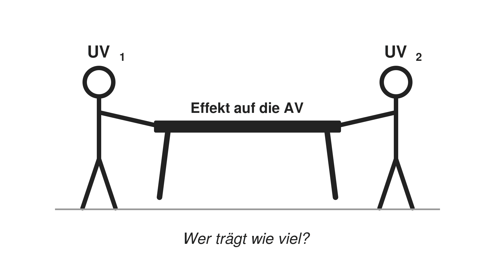
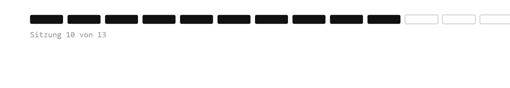

## Willkommen zurück!


## Recap: Einfache lineare Regressionen {.smaller}

-   Eine (einfache) lineare Regression zu rechenen heißt eine Gerade durch Punkte zu ziehen!

-   UV $\rightarrow$ AV

-   Wenn x um eine Einheit steigt, ändert sich y um den Betrag b.


## Recap: Multiple lineare Regressionen



## Recap: Multiple lineare Regressionen

$$\hat{y} = b_0 + b_1 x_1 + b_2 x_2 + \ldots + b_k x_k$$

-   Die $b$-Koeffizienten geben den **spezifischen / isolierten Einfluss** jedes Prädiktors an:

-   Wenn $x_k$ um eine Einheit steigt, ändert sich $y$ um $b_k$,**wenn alle anderen Prädiktoren konstant bleiben** (*ceteris paribus*).

::: {.callout-tip .fragment}
## Multiple ≠ Multivariate Regression

Multiple = mehrere **unabhängige** Variablen\
Multivariate = mehrere **abhängige** Variablen
:::

## Wichtigste Marker einer Regression {.smaller}

-   Regressionskoeffizient $b$
-   Modellgüte: Bestimmtheitsmaß R² = Anteil der aufgeklärten Varianz
-   Signifikanz:
    -   p-Wert: Wie wahrscheinlich ist es, einen solchen oder noch extremeren Koeffizienten zu beobachten, wenn H$_0$ (= kein Zusammenhang) stimmte?
    -   Beispielschwellwerte: p \< 0.001 = hochsignifikant \*\*\*, p \< 0.01 = signifikant \*\*, p \< 0.05 = schwach signifikant \*, p \> 0.05 = nicht signifikant
    -   KI: 95% KI enthält 0 $\Rightarrow$ nicht signifikant; 95% KI enthält keinen Wert über 0 $\Rightarrow$ signifikant
    -   In 95 von 100 Stichproben würde das berechnete Konfidenzintervall den wahren Regressionskoeffizienten in der Grundgesamtheit enthalten.
    -   Wenn man den Zorn der Statistiker\*innen auf sich ziehen will: Der wahre Regressionskoeffizient liegt mit 95%iger Wahrscheinlichkeit im KI.


# Voraussetzungen und deren Bedeutung 

## [Überblick: Voraussetzungen der linearen Regression]{style="font-size: 0.8em;"} {.smaller}

```{r}
#| echo: false
library(dplyr)
tibble::tribble(
  ~Nr,  ~Voraussetzung,                              ~`Worauf bezogen?`,        ~`Folgen bei Verletzung`,
  "1",  "Skalenniveau (metrische AV)",               "Daten / Messung",         "Modell ist inhaltlich nicht interpretierbar",
  "2",  "Exogenität",                                "Modellspezifikation",     "Koeffizienten verzerrt (z.B. Omitted Variable Bias)",
  "3",  "Unabhängige Beobachtungen",                 "Studiendesign",           "Scheinsignifikanz",
  "4",  "Linearität",                                "Funktionale Form",        "Koeffizienten falsch",
  "5",  "Homoskedastizität",                         "Residuen",                "Scheinsignifikanz",
  "6",  "Keine Multikollinearität*",                 "UVs untereinander",       "Koeffizienten instabil, große Standardfehler",
  "7",  "Keine Ausreißer",                           "Einzelne Fälle",          "Schätzung instabil",
  "(8)", "Normalverteilung der Residuen (optional)", "Residuen",                "Nur bei kleinem n: Inferenz ungenau"
) %>%
  knitr::kable(escape = FALSE) %>%
  kableExtra::kable_styling(full_width = TRUE) %>%
  kableExtra::column_spec(1, bold = TRUE, border_right = "1px solid black") %>%
  kableExtra::column_spec(2, bold = TRUE, border_right = "1px solid black") %>%
  kableExtra::column_spec(3, border_right = "1px solid black") %>%
  kableExtra::row_spec(0:8, extra_css = "border-bottom: 1.5px solid black;") %>%
  kableExtra::row_spec(8, extra_css = "border-bottom: 1.5px solid black; color: #999999;")
```

::: {style="font-size: 0.6em;"}
\* nur bei multiplen linearen Regressionen (mind. zwei UVs).
Voraussetzungen 1–3 sind der Analyse *vorgelagert* (Daten & Design), 4–8 werden *am geschätzten Modell* geprüft.
:::


## 1 [Skalenniveau: Welches Modell für welche Skala?]{style="font-size: 0.8em;"} {.smaller}

```{r}
#| echo: false
library(dplyr)
tibble::tribble(
  ~`Skalenniveau der AV`,            ~Beispiel,                                       ~Modell,
  "Metrisch",                        "Lebenszufriedenheit (0–10), Einkommen",         "Lineare Regression (OLS) — diese Sitzung",
  "Dichotom (binär)",                "Wahlbeteiligung (ja/nein)",                     "Logistische Regression — Sitzung 11!",
  "Nominal (mehr als 2 Kategorien)", "Parteiwahl (CDU, SPD, Grüne, ...)",             "Multinomiale logistische Regression",
  "Ordinal",                         "Zustimmung (stimme gar nicht zu; egal; ...voll zu)",  "Ordinale logistische Regression",
  "Zählvariable",                    "Anzahl Demonstrationsteilnahmen",               "Poisson- / Negativ-Binomial-Regression"
) %>%
  knitr::kable(escape = FALSE) %>%
  kableExtra::kable_styling(full_width = TRUE) %>%
  kableExtra::column_spec(1, bold = TRUE, border_right = "1px solid black") %>%
  kableExtra::column_spec(2, border_right = "1px solid black") %>%
  kableExtra::row_spec(0:5, extra_css = "border-bottom: 1.5px solid black;")
```

::: {style="font-size: 0.6em;"}
Merke: Das Skalenniveau der **AV** bestimmt das Modell. Die UVs dürfen jedes Skalenniveau haben (kategoriale UVs als Dummies). Quasi-metrische AVs (z.B. 5er-Skalen) werden in der Praxis oft mit OLS gerechnet — umstritten, aber verbreitet.
:::

## 2 Exogenität {.smaller}

-   Die UVs dürfen nicht mit dem Fehlerterm korrelieren → alles, was die AV beeinflusst und *nicht* im Modell steht, darf nicht systematisch mit den UVs zusammenhängen.

-   Häufigste Verletzung: Omitted Variable Bias (OVB) → relevante Variable fehlt im Modell, die mit einer UV **und** der AV korreliert

    -   Beispiel: Einkommen \~ Bildung

    -   Fehlt: soziale Herkunft (beeinflusst Bildung *und* Einkommen)

    -   Herkunftseffekt landet im Fehlerterm → korreliert mit Bildung

    -   Bildungskoeffizient „schluckt" den Herkunftseffekt → **verzerrt**

-   Die Schätzung selbst wird falsch — nicht nur die Standardfehler!

-   Kein statistischer Test möglich (ε ist unbeobachtbar)

-   Theoriegeleitete Lösung: *Welche Variablen beeinflussen AV und UV gemeinsam?* → als Kontrollvariablen aufnehmen.

-   Vollständige Lösung nur über Forschungsdesign (Experimente → fortgeschrittene Methoden)

## 3 Unabhängige Beobachtungen

-   **Was heißt das?** Die Beobachtungen beeinflussen sich nicht gegenseitig
-   Bsp. für Cluster: Regionen, Klassen, Länder, Haushalte, Personen über die Zeit (Paneldaten)
-   **Warum problematisch?** Das Modell tut so, als hätte es unabhängige Datenpunkte → ist sich zu sicher → Standardfehler zu klein → Effekte erscheinen signifikant, obwohl sie es nicht sind (Scheinsignifikanz)
-   Prüfung nicht statistisch, sondern über das **Studiendesign**
-   Lösungen: Abhängigkeiten explizit modellieren statt sie zu ignorieren!

## 3 Unabhängige Beobachtungen{.smaller}

```{r}
#| echo: false
library(dplyr)
tibble::tribble(
  ~Abhängigkeitsstruktur,        ~Beispiel,                                  ~`Lösung`,
  "Cluster (Fälle in Gruppen)",  "Schüler:innen in Klassen, Befragte in Ländern", "Mehrebenenmodell oder cluster-robuste Standardfehler",
  "Messwiederholung",            "Panelbefragung (z.B. SOEP)",               "Fixed-/Random-Effects-Panelmodelle",
  "Zeitliche Abfolge",           "monatliche Umfragewerte einer Partei",     "Zeitreihenmodelle, autokorrelations-robuste Standardfehler",
  "Räumliche Nähe",              "benachbarte Wahlkreise ähneln sich",       "räumliche Regressionsmodelle"
) %>%
  knitr::kable(escape = FALSE) %>%
  kableExtra::kable_styling(full_width = TRUE) %>%
  kableExtra::column_spec(1, bold = TRUE, border_right = "1px solid black") %>%
  kableExtra::column_spec(2, border_right = "1px solid black") %>%
  kableExtra::row_spec(0:4, extra_css = "border-bottom: 1.5px solid black;")
```

::: {style="font-size: 0.6em;"}
Alle Verfahren → fortgeschrittene Methoden; hier nur als Ausblick. Im ALLBUS (Zufallsstichprobe einzelner Personen) ist die Annahme erfüllt.
:::

## 4 Linearität

-   **Was heißt das?** Der Zusammenhang zwischen UV und AV lässt sich durch eine Gerade beschreiben — der Effekt ist überall gleich stark
-   Eine Gerade durch einen gekrümmten Zusammenhang beschreibt die Daten falsch — Koeffizient und Vorhersagen sind verzerrt
-   Beispiel: Alter und Lebenszufriedenheit verlaufen oft U-förmig — eine Gerade würde fälschlich „kein Effekt" zeigen
-   **Lösung**: Polynomiale Regression (z.B. Alter²) oder Spline-Modelle

## 5 Homoskedastizität

-   **Was heißt das?** Die Residuen streuen über alle vorhergesagten Werte hinweg gleich stark — das Modell ist überall gleich (un)genau
-   Bei ungleicher Streuung (Heteroskedastizität) sind die **Standardfehler falsch** → p-Werte und KIs nicht verlässlich
-   Die Koeffizienten selbst bleiben unverzerrt — nur die Signifikanzaussagen leiden
-   Lösung: Heteroskedastizitätsrobuste Standardfehler (z.B. HC3)

## 6 Keine Multikollinearität

::::: columns
::: {.column width="60%"}
-   Multikollinearität liegt vor, wenn zwei (oder mehr) UVs so stark korrelieren, dass sie im Grunde dasselbe messen
-   Bsp.: Bildungsjahre und höchster Abschluss
-   **Warum problematisch?** Interpretation einzelner Koeffizienten wird unzuverlässig und Standardfehler sehr groß! (Vorhersagekraft des Modells bleibt ok.)
:::

::: {.column width="40%"}

:::
:::::

## 7 Keine Ausreißer

-   **Was heißt das?** Kein einzelner Fall dominiert die Schätzung
-   **Warum problematisch?** Bei OLS werden Residuen **quadriert** — extreme Fälle bekommen dadurch überproportionales Gewicht und können die Gerade regelrecht „zu sich ziehen"
-   Wichtig: Ausreißer prüfen heißt nicht automatisch ausschließen! Erst klären: Datenfehler oder echter Extremfall?

## 8 Normalverteilte Residuen

-   **Was heißt das?** Die Abweichungen vom Modell sind zufällig und symmetrisch — viele kleine, wenige große Fehler
-   **Warum problematisch?** p-Werte und KIs basieren auf der t-Verteilung — diese Herleitung setzt normalverteilte Residuen voraus
-   Bei großem n entschärft sich das Problem (zentraler Grenzwertsatz), daher in der Praxis meistens irrelevant!

# Voraussetzungen prüfen 

## Prüfung d. Voraussetzungen {.smaller}

```{r}
#| echo: false
library(dplyr) 
tibble::tribble(
  ~Voraussetzung, ~`Prüfung`,
  "Skalenniveau (metrische AV)*", "<b>theoretisch:</b> Codebuch, Theorie",
  "Exogenität", "<b>theoretisch:</b> relevante Kontrollvariablen im Modell?",
  "Unabhängige Beobachtungen", "<b>theoretisch:</b> Studiendesign",
  "Linearer Zusammenhang", "<b>grafisch:</b> Scatterplot + Loess; Residuen vs. Fitted<br><b>statistisch:</b> Rainbow-Test",
  "Homoskedastizität der Residuen", "<b>grafisch:</b> Residuen vs. Fitted-Plot<br><b>statistisch:</b> Breusch-Pagan-Test",
  "Keine Multikollinearität**", "<b>statistisch:</b> Variance Inflation Factor (VIF)",
  "Keine Ausreißer", "<b>grafisch:</b> Cook's Distance<br><b>statistisch:</b> Anteil > Schwellwert",
  "Normalverteilte Residuen", "<b>grafisch:</b> Histogramm, Q-Q-Plot<br><b>statistisch:</b> Shapiro-Wilk***"
) %>%
  knitr::kable(escape = FALSE, format = "html") %>%
  kableExtra::kable_styling(full_width = TRUE) %>%
  kableExtra::column_spec(1, bold = TRUE, border_right = "1.5px solid black") %>%
  kableExtra::row_spec(0:8, extra_css = "border-bottom: 1.5px solid black;")
```

::: {style="font-size: 0.6em;"}
\* Die UVen können metrisch oder kategorial sein; kategoriale mit mehr als zwei Ausprägungen werden als Dummies kodiert.\
\*\* nur bei multiplen linearen Regressionen\
\*\*\* nur bis n = 5000; bei großem n grafische Prüfung bevorzugen
:::

# Remedies bei Verletzung 


## Was tun bei Verletzung der Annahmen? {.smaller}

```{r}
#| echo: false
library(dplyr)
tibble::tribble(
  ~Verletzung,                       ~`Lösung`,
  "Skalenniveau (AV nicht metrisch)", "Anderes Modell wählen, z.B. logistische Regression bei binärer AV (→ Sitzung 11!)",
  "Exogenität verletzt",             "Relevante Kontrollvariablen aufnehmen; vollständig nur über Forschungsdesign lösbar (fortgeschritten)",
  "Abhängige Beobachtungen",         "Cluster-robuste Standardfehler; Mehrebenen- oder Panelmodelle (FE/RE)",
  "Kein linearer Zusammenhang",      "U-Form → UV quadrieren (I(x^2)) · Sättigung → UV logarithmieren (log(x)) · exponentielles Wachstum → AV logarithmieren (log(y)) · Schwellenwert → UV kategorisieren · komplexe Formen → Splines (fortgeschritten)",
  "Heteroskedastizität",             "Heteroskedastizitätsrobuste Standardfehler (HC3)*",
  "Multikollinearität",              "Eine der korrelierten UVen ausschließen oder zu Index zusammenfassen",
  "Ausreißer",                       "Fälle prüfen; Modell mit & ohne Ausreißer vergleichen; ggf. ausschließen; oder robuste Regression (fortgeschritten)",
  "Nicht normalverteilte Residuen",  "Bei großem n unkritisch (zentraler Grenzwertsatz); bei kleinem n: Bootstrapping (fortgeschritten)"
) %>%
  knitr::kable(escape = FALSE, format = "html") %>%
  kableExtra::kable_styling(full_width = TRUE, font_size = 20) %>%
  kableExtra::column_spec(1, bold = TRUE, border_right = "1.5px solid black") %>%
  kableExtra::row_spec(0:7, extra_css = "border-bottom: 1.5px solid black;") %>%
  kableExtra::row_spec(4:5, extra_css = "border-bottom: 1.5px solid black; background-color: rgba(184, 219, 73, 0.25);")
```

::: {style="font-size: 0.6em;"}
\* Long JS & Ervin LH (2000). Using heteroscedasticity consistent standard errors in the linear regression model. *The American Statistician*, 54(3), 217–224. Zum Vertiefen: Kapitel 21 bis 24 in Wagemann, Goerres & Siewert (2020). *Handbuch Methoden der Politikwissenschaft*. Springer.
:::


## Verletzung d. Linearität

```{r}
#| echo: false
#| fig-height: 3.5
#| fig-width: 10
library(dplyr)
library(ggplot2)
library(patchwork)
set.seed(26)
n <- 300
sim <- dplyr::tibble(
  x = runif(n, 0, 10),
  y_linear = 2 + 0.5 * x + rnorm(n, sd = 1),
  y_uform  = 8 - 2.2 * x + 0.22 * x^2 + rnorm(n, sd = 1),
  y_saett  = 8 * (1 - exp(-0.5 * x)) + rnorm(n, sd = 0.8),
  y_expo   = exp(0.35 * x + rnorm(n, sd = 0.3)),
  y_knick  = 2 + 3 * (x > 5) + rnorm(n, sd = 0.8)
)

plot_panel <- function(data, yvar, titel, loesung_formel = NULL) {
  p <- data %>%
    ggplot2::ggplot(mapping = ggplot2::aes(x = x, y = .data[[yvar]])) +
    ggplot2::geom_point(alpha = 0.3) +
    ggplot2::geom_smooth(method = "lm", se = FALSE, color = "red") +
    ggplot2::labs(title = titel, x = NULL, y = NULL) +
    ggplot2::theme_minimal()
  if (!is.null(loesung_formel)) {
    p <- p + ggplot2::geom_smooth(method = "lm", formula = loesung_formel,
                                  se = FALSE, color = "darkgreen")
  }
  p
}

plot_panel(sim, "y_linear", "Linear: ok") +
  plot_panel(sim, "y_uform", "U-Form: verletzt") +
  plot_panel(sim, "y_saett", "Sättigung: verletzt")
```

-   Rot = lineares Modell
-   Liegt die Punktwolke systematisch daneben → Annahme verletzt
-   Vier typische Muster + Lösungen auf den nächsten Folien

## Muster 1: U-Form

::::: columns
::: {.column width="55%"}
```{r}
#| echo: false
#| fig-height: 4.5
#| fig-width: 5.5
plot_panel(sim, "y_uform", NULL, loesung_formel = y ~ x + I(x^2))
```
:::

::: {.column width="45%"}
**Beispiel:** Lebenszufriedenheit \~ Alter (Tief in der Lebensmitte)

**Lösung:** quadratischen Term ergänzen

```{r}
#| eval: false
lm(ls01 ~ age + I(age^2), ...)
```

[Rot]{style="color: red;"} = lineares Modell verfehlt die Kurve\
[Grün]{style="color: darkgreen;"} = Modell mit `I(x^2)` fängt sie ein
:::
:::::

## Muster 2: Sättigung

::::: columns
::: {.column width="55%"}
```{r}
#| echo: false
#| fig-height: 4.5
#| fig-width: 5.5
plot_panel(sim, "y_saett", NULL, loesung_formel = y ~ log(x + 0.1))
```
:::

::: {.column width="45%"}
**Beispiel:** Lebenszufriedenheit \~ Einkommen (jeder zusätzliche Euro bringt weniger)

**Lösung:** UV logarithmieren

```{r}
#| eval: false
lm(ls01 ~ log(incc), ...)
```

Nur bei positiven Werten möglich!
:::
:::::

## Muster 3: Exponentielles Wachstum

::::: columns
::: {.column width="55%"}
```{r}
#| echo: false
#| fig-height: 4.5
#| fig-width: 5.5
fit_log <- lm(log(y_expo) ~ x, data = sim)

sim %>%
  ggplot2::ggplot(mapping = ggplot2::aes(x = x, y = y_expo)) +
  ggplot2::geom_point(alpha = 0.3) +
  ggplot2::geom_smooth(method = "lm", se = FALSE, color = "red") +
  ggplot2::geom_line(mapping = ggplot2::aes(y = exp(predict(fit_log))),
                     color = "darkgreen", linewidth = 1) +
  ggplot2::labs(x = NULL, y = NULL) +
  ggplot2::theme_minimal()
```
:::

::: {.column width="45%"}
**Beispiel:** AV wächst prozentual statt absolut (z.B. Kampagnenbudgets)

**Lösung:** AV logarithmieren

```{r}
#| eval: false
lm(log(spending) ~ x, ...)
```

Koeffizienten dann näherungsweise als %-Änderung interpretierbar
:::
:::::

## Muster 4: Schwellenwert / Knick

::::: columns
::: {.column width="55%"}
```{r}
#| echo: false
#| fig-height: 4.5
#| fig-width: 5.5
plot_panel(sim, "y_knick", NULL, loesung_formel = y ~ I(x > 5))
```
:::

::: {.column width="45%"}
**Beispiel:** Effekt setzt erst ab bestimmtem Wert ein (z.B. Sperrklausel)

**Lösung:** UV kategorisieren (Dummy)

```{r}
#| eval: false
lm(y ~ I(x > schwelle), ...)
```
:::
:::::

## Linearität: typische Muster & Lösungen {.smaller}

```{r}
#| echo: false
tibble::tribble(
  ~Muster,                        ~`Beispiel`,                                          ~`Lösung`,
  "U-Form / umgekehrte U-Form",   "Lebenszufriedenheit ~ Alter",                        "Quadratischer Term: I(x^2)",
  "Sättigung",                    "Lebenszufriedenheit ~ Einkommen",                    "UV logarithmieren: log(x)",
  "Exponentielles Wachstum",      "AV wächst prozentual statt absolut",                 "AV logarithmieren: log(y)",
  "Schwellenwert / Knick",        "Effekt erst ab bestimmtem Wert (z.B. Sperrklausel)", "UV kategorisieren",
  "Komplexe Wellenform",          "mehrfache Richtungswechsel",                         "Splines (→ fortgeschrittene Methoden)"
) %>%
  knitr::kable(escape = FALSE) %>%
  kableExtra::kable_styling(full_width = TRUE) %>%
  kableExtra::column_spec(1, bold = TRUE, border_right = "1px solid black") %>%
  kableExtra::column_spec(2, border_right = "1px solid black") %>%
  kableExtra::row_spec(0:5, extra_css = "border-bottom: 1.5px solid black;")
```

::: {style="font-size: 0.6em;"}
Faustregel: ein Bogen → quadratischer Term · einseitiges Abflachen → `log()` (nur bei positiven Werten) · mehr als zwei Richtungswechsel → Splines
:::

## Annahme d. Homoskedastizität

```{r}
#| echo: false
  
library(ggplot2)
library(patchwork)
library(tibble)

set.seed(42)
n <- 300
x <- runif(n, 10, 50)

df <- tibble(
  x = x,
  y_homo = 3 + 1.5 * x + rnorm(n, 0, 10),       # Constant variance
  y_hetero = 3 + 1.5 * x + rnorm(n, 0, 0.8 * x) # Increasing variance
)

df$fit_homo <- fitted(lm(y_homo ~ x, data = df)) # Extract fitted values
df$res_homo <- resid(lm(y_homo ~ x, data = df))  # Extract residuals
df$fit_hetero <- fitted(lm(y_hetero ~ x, data = df))
df$res_hetero <- resid(lm(y_hetero ~ x, data = df))

p1 <- ggplot(df, aes(x = fit_homo, y = res_homo)) +
  geom_point(alpha = 0.5) +
  geom_hline(yintercept = 0, linetype = "dashed", color = "red") +
  theme_minimal() +
  labs(title = "Homoskedastizität", subtitle = "Gleiche Streuung", x = "Vorhergesagte Werte (Fitted)", y = "Residuen")

p2 <- ggplot(df, aes(x = fit_hetero, y = res_hetero)) +
  geom_point(alpha = 0.5) +
  geom_hline(yintercept = 0, linetype = "dashed", color = "red") +
  theme_minimal() +
  labs(title = "Heteroskedastizität", subtitle = "Trichterform", x = "Vorhergesagte Werte (Fitted)", y = "Residuen")

p1 + p2
```


## Robuste Standardfehler (HC3)

-   Problem Heteroskedastizität: Die Streuung der Residuen ist nicht überall gleich → die normalen Standardfehler sind **zu klein oder zu groß**
-   Die **Koeffizienten bleiben identisch** — nur SEs, t- und p-Werte ändern sich
-   Lösung: Standardfehler werden so korrigiert, dass sie der tatsächlichen, ungleichen Streuung gerecht werden


```{{r}}
lmtest::coeftest(model_2, vcov = sandwich::vcovHC(model_2, type = "HC3"))
```


# Hands On - Diagnostics


## Minute Cards

Bitte füllt die Minute Cards für die heutige Sitzung aus. Das sollt enicht länger als 3 Minuten dauern. Vielen Dank für eure Mitarbeit!

```{r}
#| echo: false
library(qrcode)
qr <- qrcode::qr_code("https://forms.gle/xScN9nh3n2yjZXXK8")
plot(qr)
```

# Vielen Dank und bis kommenden Dienstag!

::: {style="margin-top: 1em;"}

:::

::: {style="display: flex; align-items: center; gap: 1em; "}
{style="width: 140px;"}

**Übung 10 zu Regressionsdiagnostik** bis spätestens Sonntagabend!
:::

