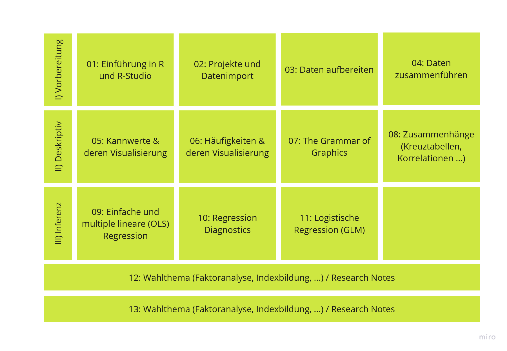
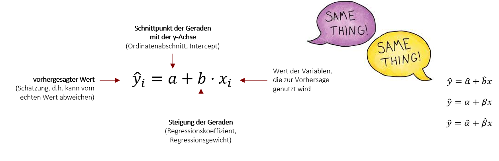
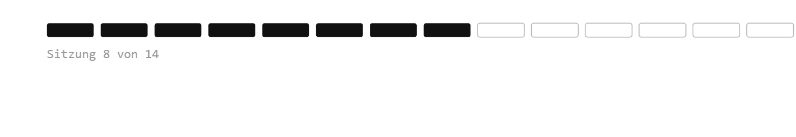

## Willkommen zurück!



## Recap: Einfache und multiple lineare Regressionen {.smaller}

-   Eine (einfache) lineare Regression zu rechenen heißt eine Gerade durch Punkte zu ziehen!

-   UV $\rightarrow$ AV

-   Wenn x um eine Einheit steigt, ändert sich y um den Betrag b.



## Wichtigste Marker einer Regression

-   Regressionskoeffizient $b$
-   Modellgüte: Bestimmtheitsmaß R² = Anteil der aufgeklärten Varianz
-   Signifikanz:
    -   p-Wert: Wie wahrscheinlich ist es, einen solchen oder noch extremeren Koeffizienten zu beobachten, wenn H$_0$ (= kein Zusammenahng) stimmte?
    -   Beispielschwellwerte: p \< 0.001 = hochsignifikant \*\*\*, p \< 0.01 = signifikant \*\*, p \< 0.05 = schwach signifikant \*, p \> 0.05 = nicht signifikant
    -   KI: 95% KI enthält 0 $\Rightarrow$ nicht signifikant; 95% KI enthält keinen Wert über 0 $\Rightarrow$ signifikant
    -   In 95 von 100 Stichproben würde das berechnete Konfidenzintervall den wahren Regressionskoeffizienten in der Grundgesamtheit enthalten.
    -   Wenn man den Zorn der Statistiker\*innen auf sich zeihen will: Der wahre Regressionskoeffizient liegt mit 95%iger Wahrscheinlichkeit im KI.


## Voraussetzungen

| Voraussetzung | Prüfung grafisch | Prüfung statistisch |
|----|----|----|
| Linearer Zusammenhang | Scatterplot + Loess; Residuen vs. Fitted | Rainbow-Test |
| Homoskedastizität der Residuen | Residuen vs. Fitted-Plot | Breusch-Pagan-Test |
| Normalverteilte Residuen | Histogramm, Q-Q-Plot | Shapiro-Wilk\* |
| Unabhängige Beobachtungen | — | Studiendesign |
| Keine Ausreißer | Cook's Distance | Anteil > Schwellwert |
| Keine Multikollinearität\*\* | — | Variance Inflation Factor (VIF) |

::: {style="font-size: 0.6em;"}
\* nur bis n = 5000; bei großem n grafische Prüfung bevorzugen\
\*\* nur bei multiplen linearen Regressionen
:::


## Die Annahmen inhaltlich: Linearität

- **Was heißt das?** Der Zusammenhang zwischen UV und AV lässt sich 
  durch eine Gerade beschreiben — der Effekt ist überall gleich stark
- **Warum problematisch?** Eine Gerade durch einen gekrümmten Zusammenhang 
  beschreibt die Daten falsch — Koeffizient und Vorhersagen sind verzerrt
- Beispiel: Alter und Lebenszufriedenheit verlaufen oft U-förmig — 
  eine Gerade würde fälschlich „kein Effekt" zeigen


## Annahme: Linearität

::: columns
::: {.column width="55%"}
**Prüfung mit Loess-Kurve:**

```{{r}}
#| eval: false
allbus_c_2023 %>%
  ggplot2::ggplot(mapping = ggplot2::aes(x = age, y = ls01)) +
  ggplot2::geom_jitter(alpha = 0.2) +
  ggplot2::stat_smooth(method = "loess")
```

- Kurve annähernd gerade → Linearität ok
- Klare, systematische Biegung → verletzt
- Kleine Wellen an den Rändern sind normal (dort liegen wenige Datenpunkte)
:::

::: {.column width="45%"}
<!-- Screenshot: nicht-lineare Muster (U-Form, Sättigung etc.) -->

:::
:::

---

## Linearität verletzt — was tun?

Typische Verletzung: **U-Form** (z.B. Lebenszufriedenheit ~ Alter)

→ Lösung: **quadratischen Term** ergänzen (polynomiale Regression)

```{{r}}
#| eval: false
model_quad <- lm(ls01 ~ incc + age + I(age^2) + sex_bi + hs01,
                 data = allbus_c_2023,
                 weights = wghtpew)
```

- `I(age^2)` fügt Alter² als zusätzlichen Prädiktor hinzu — das Modell kann nun eine Kurve abbilden
- **Achtung Interpretation:** Der Alterseffekt hängt jetzt vom Alter selbst ab — beide Koeffizienten (`age` + `I(age^2)`) müssen gemeinsam interpretiert werden
- Bei komplexeren Formen: Spline-Modelle (→ fortgeschrittene Methoden)


## Die Annahmen inhaltlich: Homoskedastizität

- **Was heißt das?** Die Residuen streuen über alle vorhergesagten Werte 
  hinweg gleich stark — das Modell ist überall gleich (un)genau
- **Warum problematisch?** Bei ungleicher Streuung (Heteroskedastizität) 
  sind die **Standardfehler falsch** → p-Werte und KIs nicht verlässlich
- Die Koeffizienten selbst bleiben unverzerrt — nur die 
  Signifikanzaussagen leiden

## Die Annahmen inhaltlich: Normalverteilte Residuen

- **Was heißt das?** Die Abweichungen vom Modell sind zufällig und 
  symmetrisch — viele kleine, wenige große Fehler
- **Warum problematisch?** p-Werte und KIs basieren auf der t-Verteilung — 
  diese Herleitung setzt normalverteilte Residuen voraus
- Bei großem n entschärft sich das Problem (zentraler Grenzwertsatz), 
  trotzdem prüfen!

## Die Annahmen inhaltlich: Unabhängigkeit

- **Was heißt das?** Die Beobachtungen beeinflussen sich nicht gegenseitig — 
  jede Person ist „ein eigener Fall"
- **Warum problematisch?** Abhängige Fälle (z.B. Paare, Schulklassen, 
  Messwiederholungen) liefern weniger Information als ihr n suggeriert 
  → Standardfehler zu klein, Scheinsignifikanz
- Prüfung nicht statistisch, sondern über das **Studiendesign**

## Die Annahmen inhaltlich: Keine Ausreißer

- **Was heißt das?** Kein einzelner Fall dominiert die Schätzung
- **Warum problematisch?** Bei OLS werden Residuen **quadriert** — 
  extreme Fälle bekommen dadurch überproportionales Gewicht und können 
  die Gerade regelrecht „zu sich ziehen"
- Wichtig: Ausreißer prüfen heißt nicht automatisch ausschließen! 
  Erst klären: Datenfehler oder echter Extremfall?

## Die Annahmen inhaltlich: Keine Multikollinearität

- **Was heißt das?** Die UVs messen nicht (fast) dasselbe — 
  jede liefert eigene Information
- **Warum problematisch?** Wenn UVs stark korrelieren, kann das Modell 
  ihre Effekte **nicht mehr auseinanderhalten** → Koeffizienten werden 
  instabil, Standardfehler explodieren
- Beispiel: Bildungsjahre und höchster Abschluss im selben Modell


## Was tun bei Verletzung der Annahmen?

| Verletzung | Lösung |
|----|----|
| Kein linearer Zusammenhang | Polynomiale Regression / Spline-Modell |
| Heteroskedastizität | Robuste Standardfehler (HC3)\* |
| Ausreißer | Robuste Regression |
| Keine Normalverteilung der Residuen | Bootstrapping (ab n > 50) |
| Multikollinearität | Variablen ausschließen / transformieren, Ridge / Lasso |

::: {style="font-size: 0.6em;"}
\* Long JS & Ervin LH (2000). Using heteroscedasticity consistent standard errors in the linear regression model. *The American Statistician*, 54(3), 217–224.
:::
::: {style="font-size: 0.75em; color: #555;"}
Zum Vertiefen: Wagemann, Goerres & Siewert (2020). *Handbuch Methoden der Politikwissenschaft*. Springer.
:::


## Robuste Standardfehler (HC3)

- Problem Heteroskedastizität: Die Streuung der Residuen ist nicht überall 
  gleich → die normalen Standardfehler sind **zu klein oder zu groß**
- Lösung: Standardfehler werden so korrigiert, dass sie der tatsächlichen, 
  ungleichen Streuung gerecht werden
- Die **Koeffizienten bleiben identisch** — nur SEs, t- und p-Werte ändern sich

```{{r}}
lmtest::coeftest(model_2, vcov = sandwich::vcovHC(model_2, type = "HC3"))
```

## Bootstrapping

- Problem: Residuen nicht normalverteilt → t-Verteilung als Grundlage 
  der p-Werte ist nicht mehr gerechtfertigt
- Lösung: R zieht **viele Stichproben aus unserer Stichprobe** 
  (mit Zurücklegen, gleiches n) und rechnet z.B. 2000 Regressionen
- Aus den 2000 Koeffizienten entsteht eine **empirische Verteilung** 
  → daraus wird das KI direkt abgelesen, ohne Verteilungsannahme
- Liegt die 0 nicht im KI → Effekt signifikant

```{{r}}
set.seed(1234)
fit_b <- car::Boot(model_2, R = 2000)
confint(fit_b, level = .95)
```

## Anwendung in R

```{r}
#| echo: true
#| eval: false

# Einfache lineare Regression
modell_1 <- lm(av ~ uv, data = datensatz)
summary(modell_1)

# Multiple lineare Regression
modell_2 <- lm(av ~ uv1 + uv2 + uv3, data = datensatz)
summary(modell_2)
```

::: {style="margin-top: 0.5em; font-size: 0.9em;"}
-   `lm()` = *linear model*
-   Formelschreibweise: `av ~ uv` (AV links, UV rechts)
-   `summary()` zeigt Koeffizienten, $R^2$, p-Werte
:::

# Hands On - Regressionen


## Minute Cards

Bitte füllt die Minute Cards für die heutige Sitzung aus. Das sollt enicht länger als 3 Minuten dauern. Vielen Dank für eure Mitarbeit!

```{r}
#| echo: false
library(qrcode)
qr <- qrcode::qr_code("https://forms.gle/xScN9nh3n2yjZXXK8")
plot(qr)
```

# Vielen Dank und bis kommenden Dienstag!

::: {style="margin-top: 1em;"}

:::

::: {style="display: flex; align-items: center; gap: 1em; "}
{style="width: 140px;"}

**Übung 10 zu Regressionsdiagnostik** bis spätestens Sonntagabend!
:::
