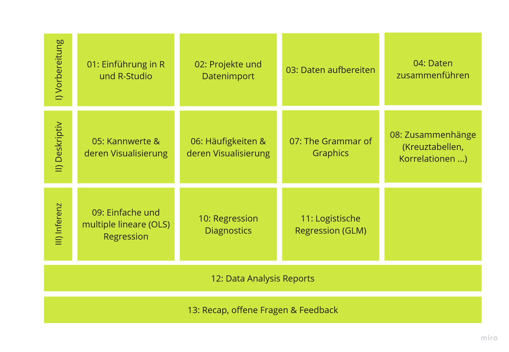
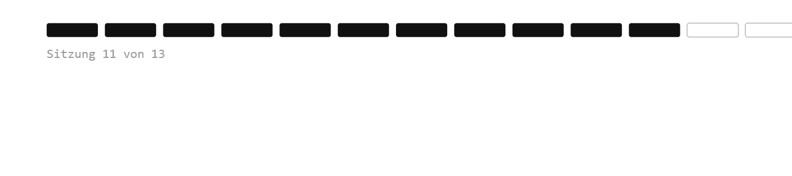

## Willkommen zurück!



## Ergänzung multiple OLS-Regression (Ü8)

-   Was bedeutet Split (-11) im Allbus-Datensatz?

-   ordinale UV in multipler linearer Regression

    -   ordinale Variablen (z.B. Schulabschluss) können entweder als quasi-metrisch oder als kategorial, also factor, behandelt werden

    -   bei kategorialen Variablen werden allerdings automatisch dummies für jede Kategorie gegenüber der Referenzkategorie gebildet → ggf. kleines n pro Kategorie → große SEs und CIs

::: {.callout-tip .fragment}
## Praxistipps

-   dünn besetzte Kategorien zusammenfassen (z.B. „Fachhochschulreife" + „Hochschulreife" → „(Fach-)Hochschulreife")

-   Je mehr Stufen, desto unproblematischer die quasi-metrische Behandlung. Ab \~5–7 Stufen wird sie in den Sozialwissenschaften breit akzeptiert.
:::

## [Recap: Voraussetzungen der linearen Regression]{style="font-size: 0.8em;"} {.smaller}

```{r}
#| echo: false
library(dplyr)
tibble::tribble(
  ~Nr,  ~Voraussetzung,                              ~`Worauf bezogen?`,        ~`Folgen bei Verletzung`,
  "1",  "Skalenniveau (metrische AV)",               "Daten / Messung",         "Modell ist inhaltlich nicht interpretierbar",
  "2",  "Exogenität",                                "Modellspezifikation",     "Koeffizienten verzerrt (z.B. Omitted Variable Bias)",
  "3",  "Unabhängige Beobachtungen",                 "Studiendesign",           "Scheinsignifikanz",
  "4",  "Linearität",                                "Funktionale Form",        "Koeffizienten falsch",
  "5",  "Homoskedastizität",                         "Residuen",                "Scheinsignifikanz",
  "6",  "Keine Multikollinearität*",                 "UVs untereinander",       "Koeffizienten instabil, große Standardfehler",
  "7",  "Keine Ausreißer",                           "Einzelne Fälle",          "Schätzung instabil",
  "(8)", "Normalverteilung der Residuen (optional)", "Residuen",                "Nur bei kleinem n: Inferenz ungenau"
) %>%
  knitr::kable(escape = FALSE) %>%
  kableExtra::kable_styling(full_width = TRUE) %>%
  kableExtra::column_spec(1, bold = TRUE, border_right = "1px solid black") %>%
  kableExtra::column_spec(2, bold = TRUE, border_right = "1px solid black") %>%
  kableExtra::column_spec(3, border_right = "1px solid black") %>%
  kableExtra::row_spec(0:8, extra_css = "border-bottom: 1.5px solid black;") %>%
  kableExtra::row_spec(8, extra_css = "border-bottom: 1.5px solid black; color: #999999;")
```

::: {style="font-size: 0.6em;"}
\* nur bei multiplen linearen Regressionen (mind. zwei UVs). Voraussetzungen 1–3 sind der Analyse *vorgelagert* (Daten & Design), 4–8 werden *am geschätzten Modell* geprüft.
:::

## [Recap: Prüfung d. Voraussetzungen]{style="font-size: 0.8em;"} {.smaller}

```{r}
#| echo: false
library(dplyr) 
tibble::tribble(
  ~Voraussetzung, ~`Prüfung`,
  "Skalenniveau (metrische AV)*", "<b>theoretisch:</b> Codebuch, Theorie",
  "Exogenität", "<b>theoretisch:</b> relevante Kontrollvariablen im Modell?",
  "Unabhängige Beobachtungen", "<b>theoretisch:</b> Studiendesign",
  "Linearer Zusammenhang", "<b>grafisch:</b> Scatterplot + Loess; Residuen vs. Fitted<br><b>statistisch:</b> Rainbow-Test",
  "Homoskedastizität der Residuen", "<b>grafisch:</b> Residuen vs. Fitted-Plot<br><b>statistisch:</b> Breusch-Pagan-Test",
  "Keine Multikollinearität**", "<b>statistisch:</b> Variance Inflation Factor (VIF)",
  "Keine Ausreißer", "<b>grafisch:</b> Cook's Distance<br><b>statistisch:</b> Anteil > Schwellwert",
  "Normalverteilte Residuen", "<b>grafisch:</b> Histogramm, Q-Q-Plot<br><b>statistisch:</b> Shapiro-Wilk***"
) %>%
  knitr::kable(escape = FALSE, format = "html") %>%
  kableExtra::kable_styling(full_width = TRUE) %>%
  kableExtra::column_spec(1, bold = TRUE, border_right = "1.5px solid black") %>%
  kableExtra::row_spec(0:8, extra_css = "border-bottom: 1.5px solid black;")
```

::: {style="font-size: 0.6em;"}
\* Die UVen können metrisch oder kategorial sein; kategoriale mit mehr als zwei Ausprägungen werden als Dummies kodiert.\
\*\* nur bei multiplen linearen Regressionen\
\*\*\* nur bis n = 5000; bei großem n grafische Prüfung bevorzugen
:::

## [Recap: Was tun bei Verletzung der Annahmen?]{style="font-size: 0.8em;"} {.smaller}

```{r}
#| echo: false
library(dplyr)
tibble::tribble(
  ~Nr,   ~Verletzung,                        ~`Lösung`,
  "1",   "Skalenniveau (AV nicht metrisch)", "Anderes Modell wählen, z.B. logistische Regression bei binärer AV (→ Sitzung 11!)",
  "2",   "Exogenität verletzt",              "Relevante Kontrollvariablen aufnehmen; vollständig nur über Forschungsdesign lösbar (fortgeschritten)",
  "3",   "Abhängige Beobachtungen",          "Cluster-robuste Standardfehler; Mehrebenen- oder Panelmodelle (FE/RE)",
  "4",   "Kein linearer Zusammenhang",       "U-Form → UV quadrieren (I(x^2)) · Sättigung → UV logarithmieren (log(x)) · exponentielles Wachstum → AV logarithmieren (log(y)) · Schwellenwert → UV kategorisieren · komplexe Formen → Splines (fortgeschritten)",
  "5",   "Heteroskedastizität",              "Heteroskedastizitätsrobuste Standardfehler (HC3)*",
  "6",   "Multikollinearität",               "Eine der korrelierten UVen ausschließen oder zu Index zusammenfassen",
  "7",   "Ausreißer",                        "Fälle prüfen; Modell mit & ohne Ausreißer vergleichen; ggf. ausschließen; oder robuste Regression (fortgeschritten)",
  "(8)", "Nicht normalverteilte Residuen",   "Bei großem n unkritisch (zentraler Grenzwertsatz); bei kleinem n: Bootstrapping (fortgeschritten)"
) %>%
  knitr::kable(escape = FALSE, format = "html") %>%
  kableExtra::kable_styling(full_width = TRUE, font_size = 20) %>%
  kableExtra::column_spec(1, bold = TRUE, border_right = "1.5px solid black") %>%
  kableExtra::column_spec(2, bold = TRUE, border_right = "1.5px solid black") %>%
  kableExtra::row_spec(0:8, extra_css = "border-bottom: 1.5px solid black;") %>%
  kableExtra::row_spec(4:5, extra_css = "border-bottom: 1.5px solid black; background-color: rgba(184, 219, 73, 0.25);")
```

::: {style="font-size: 0.6em;"}
\* Long JS & Ervin LH (2000). Using heteroscedasticity consistent standard errors in the linear regression model. *The American Statistician*, 54(3), 217–224. Zum Vertiefen: Kapitel 21 bis 24 in Wagemann, Goerres & Siewert (2020). *Handbuch Methoden der Politikwissenschaft*. Springer.
:::


## Orga

-   ihr bekommt heute eure letzte Übung (10) auf. Wenn ihr unsicher seid, ob ihr noch Ersatzleistungen erbringen müsst, um die ART für diesen Kurs zu bekommen, schreibt mir 📧
-   kommende Sitzung würde ich gern euren Data Analysis Plans widmen! Macht euch also Gedanken + gern ein paar Notizen. Schreibt mir, wenn ihr euren diskutieren wollt + gern schon mal Ideen/Themen/Forschungsfragen, sollte es schon welche geben 📧
-   individuelle Deadlines für die Abgabe d. Prüfungsleistung müssen innerhalb der Vorlesungszeit mit mir abgestimmt werden! Auch hier gerne 📧
-   Fragen zu Übung 09? 

# Logistische Regressionen

## Das Problem der binären AV {.smaller}

-   Viele politikwissenschaftliche AVs sind **binär**: gewählt/nicht gewählt, Mitglied/kein Mitglied, zugestimmt/abgelehnt (AV ∈ {0, 1})
-   Eine lineare Regression (OLS) ist hier ungeeignet:
    -   sie sagt Werte **außerhalb von \[0, 1\]** vorher (unsinnige „Wahrscheinlichkeiten")
    -   der Zusammenhang ist **nicht linear**, sondern S-förmig
    -   Residuen sind weder normalverteilt noch homoskedastisch

::: fragment
```{r}
#| echo: false
#| fig-width: 8
#| fig-height: 3.4
#| fig-align: center
library(ggplot2)
set.seed(2026)
d <- tibble::tibble(
  x = rnorm(300),
  y = rbinom(300, 1, plogis(1.4 * x))
)
ggplot(d, mapping = aes(x = x, y = y)) +
  geom_point(alpha = 0.25,
             position = position_jitter(height = 0.03, width = 0)) +
  geom_smooth(mapping = aes(color = "linear (OLS)"),
              method = "lm", se = FALSE, linetype = "dashed") +
  geom_smooth(mapping = aes(color = "logistisch (GLM)"),
              method = "glm", method.args = list(family = "binomial"),
              se = FALSE) +
  scale_y_continuous(breaks = seq(0, 1.2, by = 0.2)) +
  scale_color_manual(values = c("linear (OLS)" = "grey55",
                                "logistisch (GLM)" = "#6F9C2E")) +
  labs(x = "metrische UV", y = "P(AV = 1)", color = NULL) +
  theme_minimal(base_size = 14) +
  theme(legend.position = "top")
```
:::

## Die Lösung: ein GLM {.smaller}

-   statt eines linearen Modells (LM) ein **GLM** (*generalized linear model*)
-   der zentrale Unterschied steckt in der **Schätzmethode** – nicht mehr Ordinary least squares (OLS), sondern Maximum-Likelihood (ML):

::: fragment
```{r}
#| echo: false
library(dplyr)
tibble::tribble(
  ~` `,        ~`OLS (lineare Regression)`,                                  ~`ML (logistische Regression)`,
  "Idee",      "Gerade so legen, dass die Summe der quadrierten Residuen minimal ist (»kleinste Quadrate«)", "Koeffizienten so wählen, dass die beobachteten 0/1-Daten am wahrscheinlichsten werden (»größte Plausibilität«)",
  "Rechenweg", "exakte Formel → Ergebnis in einem Schritt",          "keine Formel → iterativ angenähert (mehrere Durchläufe)",
  "AV",        "metrisch",                                                   "binär (0/1)"
) %>%
  knitr::kable(escape = FALSE, format = "html") %>%
  kableExtra::kable_styling(full_width = TRUE) %>%
  kableExtra::column_spec(1, bold = TRUE, border_right = "1.5px solid black") %>%
  kableExtra::column_spec(2, border_right = "1.5px solid black") %>%
  kableExtra::row_spec(0:3, extra_css = "border-bottom: 1.5px solid black;")
```
:::

::: {.callout-note .fragment}
## In R

`glm(av ~ uv1 + uv2, data = ..., family = binomial(link = "logit"), weights = ...)`
:::

## Was rechnet die logistische Regression? {.smaller}

-   Wir wollen die **Wahrscheinlichkeit** $p$ modellieren, dass AV = 1 (z.B. „gewählt").

-   Problem: $p$ liegt zwischen 0 und 1 – eine Gerade läuft aber aus diesem Bereich heraus.

-   Lösung: $p$ in zwei Schritten umrechnen, bis eine Gerade passt.

::: fragment
**Schritt 1: Wahrscheinlichkeit** $p$ → Odds (Chance):

$$\text{Odds} = \frac{p}{1-p}$$
:::

-   Bedeutung: „Wie viel wahrscheinlicher ist Eintreten als Nicht-Eintreten?" (Verhältnis von Eintreten zu Nicht-Eintreten)
-   Beispiel: $p = 0{,}8 \Rightarrow \text{Odds} = \tfrac{0{,}8}{0{,}2} = 4$, also „4 zu 1"
-   Wertebereich jetzt: $0$ bis $+\infty$ (die obere Grenze ist weg)

## Was rechnet die logistische Regression? {.smaller}

**Schritt 2: Odds → Log-Odds** (Logit/logarithmierte Odds)

$$\text{logit}(p) = \ln(\text{Odds})$$

-   der Logarithmus lässt auch negative Werte zu
-   Wertebereich jetzt: $-\infty$ bis $+\infty$ → eine Gerade passt!
-   die Roh-Koeffizienten aus `glm()` sind also log-Odds → wenig anschaulich
-   für die Interpretation rechnen wir sie in **Odds Ratios** (= Chancen**verhältnis**, $e^{\beta}$) um → nächste Slide

## Drei Ebenen der Interpretation {.smaller}

```{r}
#| echo: false
library(dplyr)
tibble::tribble(
  ~Ebene,                       ~`Wie berechnet?`,                    ~`Wie lesen?`,
  "log-Odds (Roh-β)",           "direkt aus <code>glm()</code>",      "nur <b>Signifikanz</b> und <b>Richtung</b> (Vorzeichen):<br>+ erhöht, − senkt die Chance auf AV = 1",
  "Odds Ratio (OR)",            "<code>exp(β)</code>",                "<b>Effektstärke</b>: <b>Faktor</b>, um den sich die Odds ändern;<br><b>Prozent</b> = (OR − 1) · 100",
  "Vorhergesagte Wahrscheinlichkeit",       "UV-Werte in die logist. Funktion einsetzen", "konkrete <b>Wahrscheinlichkeit</b> für bestimmte Fälle<br>– am intuitivsten"
) %>%
  knitr::kable(escape = FALSE, format = "html") %>%
  kableExtra::kable_styling(full_width = TRUE) %>%
  kableExtra::column_spec(1, bold = TRUE, border_right = "1.5px solid black") %>%
  kableExtra::column_spec(2, border_right = "1.5px solid black") %>%
  kableExtra::row_spec(0:3, extra_css = "border-bottom: 1.5px solid black;")
```

::: {.callout-tip .fragment}
Faustregel: **Signifikanz & Richtung** liest man aus den log-Odds, die **Effektstärke** kommuniziert man über Odds Ratios, **konkrete Aussagen** über vorhergesagte Wahrscheinlichkeiten.
:::

## Drei unterschiedlich gut lesbare Outputs {.smaller}

$$\underbrace{\beta}_{\text{log-Odds}} \;\xrightarrow{\;e^{\beta}\;}\; \underbrace{\text{OR}}_{\text{Chancenverhältnis}} \;\longrightarrow\; \underbrace{p}_{\text{Wahrscheinlichkeit}}$$

1.  `glm()` schätzt in **log-Odds** (wenig anschaulich)
2.  $e^{\beta}$ liefert das **Odds Ratio**, indem es das Logarithmieren rückgängig macht
    -   **OR = 0,6**: eine Erhöhung der UV um eine Einheit **verringert** die Odds um 40 % (1 − 0,6 = 0,4)
    -   **OR = 1,2**: eine Erhöhung um eine Einheit **erhöht** die Odds um 20 % (1,2 − 1 = 0,2)
    -   **OR = 3,8**: eine Erhöhung um eine Einheit **erhöht** die Odds um 280 % (3,8 − 1 = 2,8)
3.  Einsetzen in die logist. Funktion liefert die vorhergesagte **Wahrscheinlichkeit** (am intuitivsten)
    -   „Für eine 30-jährige Person liegt die vorhergesagte Wahrscheinlichkeit, wählen zu gehen, bei 72 %, für eine 60-jährige bei 85 % (übrige UVs konstant gehalten)."
    -   Achtung: Derselbe OR bewirkt nicht überall denselben Sprung in $p$ – nahe $p = 0{,}5$ ist der Effekt am größten, an den Rändern (nahe 0 oder 1) kleiner (→ S-Kurve).

## Bsp.: Vom Koeffizienten zur Aussage {.smaller}

Beispiel: ein Prädiktor hat den Koeffizienten $\beta_1 = 0{,}41$.

-   **1. log-Odds:** $\beta_1 = +0{,}41 > 0$ → die UV **erhöht** die Chance auf AV = 1. *(Nur Richtung ablesen – die Zahl selbst ist schwer greifbar.)*
-   **2. Odds Ratio:** $e^{0{,}41} \approx 1{,}5$ → pro Einheit UV werden die Odds **mal 1,5**, also **+50 %**.
    -   OR \> 1 erhöht · OR \< 1 senkt · OR = 1 kein Effekt
    -   Prozent $= (\text{OR} - 1) \cdot 100$
-   **3. Vorhergesagte Wahrscheinlichkeit:** UV-Werte in $p = \tfrac{1}{1+e^{-(\beta_0+\beta_1 x)}}$ einsetzen.
    -   z.B. steigt $p$ von $0{,}30$ (bei $x = 0$) auf $0{,}39$ (bei $x = 1$)
    -   **Achtung:** der Effekt auf $p$ ist nicht konstant – er hängt vom Ausgangsniveau ab (S-Kurve!)

## Modellgüte: zwei Fehlerarten {.smaller}

Bei Schwelle 0,5 sagt das Modell „AV = 1" voraus, wenn $p > 0{,}5$. Das kann auf zwei Arten schiefgehen:

```{r}
#| echo: false
library(dplyr)
tibble::tribble(
  ~Maß,            ~Frage,                                                                         ~Beispiel,
  "Sensitivität",  "Von den tatsächlichen Ereignis-Fällen (AV = 1) – wie viele erkennt das Modell?", "von echten AfD-Wähler:innen erkannt: nur ~10 %",
  "Spezifität",    "Von den tatsächlichen Nicht-Ereignis-Fällen (AV = 0) – wie viele erkennt das Modell?", "von echten Nicht-AfD-Wähler:innen erkannt: ~99 %"
) %>%
  knitr::kable(escape = FALSE, format = "html") %>%
  kableExtra::kable_styling(full_width = TRUE) %>%
  kableExtra::column_spec(1, bold = TRUE, border_right = "1.5px solid black") %>%
  kableExtra::row_spec(0:2, extra_css = "border-bottom: 1.5px solid black;")
```

**Der Trade-Off:** Senkt man die Schwelle, steigt die Sensitivität – aber die Spezifität sinkt (und umgekehrt). Es gibt keine „richtige" Schwelle, nur einen Kompromiss je nach Anwendungsfall: Wie teuer ist ein übersehener Fall vs. ein fälschlich markierter?

::: {.callout-tip}
Bei seltenem Ereignis (kleine Basisrate) ist eine hohe Gesamttrefferquote oft trügerisch – das Modell trifft v.a. durch Erraten der Mehrheitsklasse.
:::

## Voraussetzungen im Vergleich {.smaller}

```{r}
#| echo: false
library(dplyr)
tibble::tribble(
  ~`Lineare Regression`,          ~`Logistische Regression`,
  "metrische AV",                 "binäre AV (0/1)",
  "Exogenität",                   "Exogenität",
  "Unabhängige Beobachtungen",    "Unabhängige Beobachtungen",
  "—",                            "Ausreichende Stichprobengröße*",
  "Keine einflussr. Ausreißer",   "Keine einflussr. Ausreißer",
  "Keine Multikollinearität*",    "Keine Multikollinearität**",
  "Linearität",                   "Linearität des Logits",
  "Homoskedastizität",            "— (entfällt)",
  "Normalvert. der Residuen",     "— (entfällt)"
) %>%
  knitr::kable(escape = FALSE, format = "html") %>%
  kableExtra::kable_styling(full_width = TRUE) %>%
  kableExtra::column_spec(1, border_right = "1.5px solid black") %>%
  kableExtra::row_spec(0:7, extra_css = "border-bottom: 1.5px solid black;") %>%
  kableExtra::row_spec(6:7, extra_css = "border-bottom: 1.5px solid black; color: #999999;")
```

::: {style="font-size: 0.6em;"}
\* OLS hat eine exakte Formel, ML schätzt iterativ und braucht eine große Stichprobe. Engpass ist die seltenere AV-Kategorie: Faustregel »10 events per variable« – pro Prädiktor mind. ~10 Fälle in der selteneren Kategorie. Beispiel: 4 Prädiktoren → mind. ~40 Fälle der selteneren Kategorie; bei seltenen Ereignissen entsprechend mehr.\
\*\* nur bei multiplen Regressionen (mind. zwei UVs).\
:::

## Varianten des GLM {.smaller}

```{r}
#| echo: false
library(dplyr)
tibble::tribble(
  ~`AV-Typ`,                          ~`Modell`,
  "binär (2 Kategorien)",             "Logit- oder Probit-Modell",
  "ordinal (> 2, geordnet)",          "Ordered Logit / Ordered Probit",
  "nominal (> 2, ungeordnet)",        "Multinomiales Logit / Probit",
  "Zähldaten (0, 1, 2, … Ereignisse)", "Poisson / Negativ-Binomial"
) %>%
  knitr::kable(escape = FALSE, format = "html") %>%
  kableExtra::kable_styling(full_width = TRUE) %>%
  kableExtra::column_spec(1, bold = TRUE, border_right = "1.5px solid black") %>%
  kableExtra::row_spec(0:4, extra_css = "border-bottom: 1.5px solid black;")
```

::: {style="font-size: 0.6em;"}
Alle sind GLMs mit unterschiedlicher Link-Funktion. **Heute** behandeln wir nur die **binär-logistische** Variante (Logit).
:::

## Weiterlesen {.smaller}

-   Behnke, Joachim (2015). *Logistische Regressionsanalyse: Eine Einführung*. Wiesbaden: Springer Fachmedien. doi:10.1007/978-3-658-05082-5
-   Schlittgen, Rainer (2013). *Regressionsanalysen mit R*. Lehr- und Handbücher der Statistik. De Gruyter, S. 213 ff. doi:10.1524/9783486739671

# Hands On - Logistische Regressionen


## Minute Cards

Bitte füllt die Minute Cards für die heutige Sitzung aus. Das sollt enicht länger als 3 Minuten dauern. Vielen Dank für eure Mitarbeit!

```{r}
#| echo: false
library(qrcode)
qr <- qrcode::qr_code("https://forms.gle/xScN9nh3n2yjZXXK8")
plot(qr)
```

# Vielen Dank und bis kommenden Dienstag!

::: {style="margin-top: 1em;"}

:::

::: {style="display: flex; align-items: center; gap: 1em; "}
{style="width: 140px;"}

**Übung 10 zu Logistischen Regressionen** bis spätestens Sonntagabend!
:::
